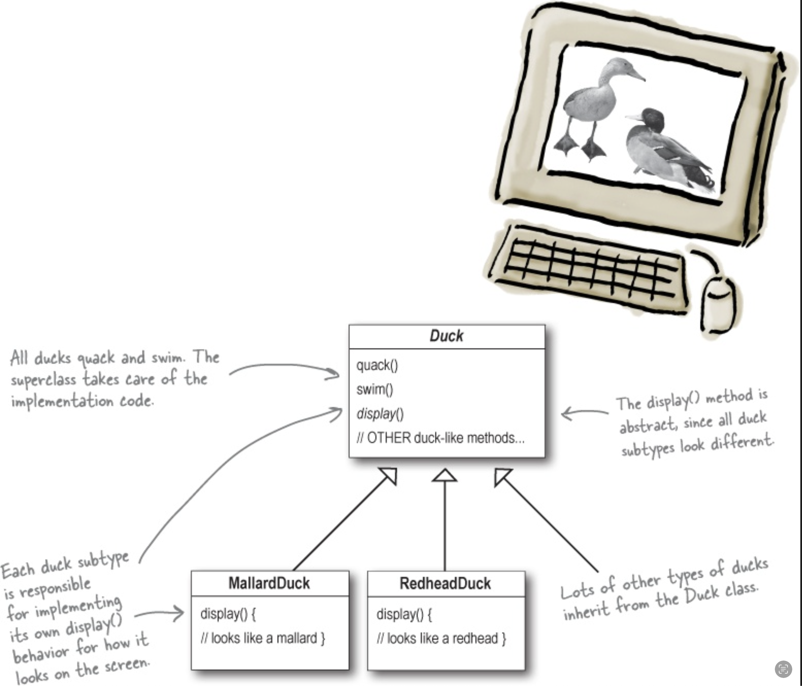
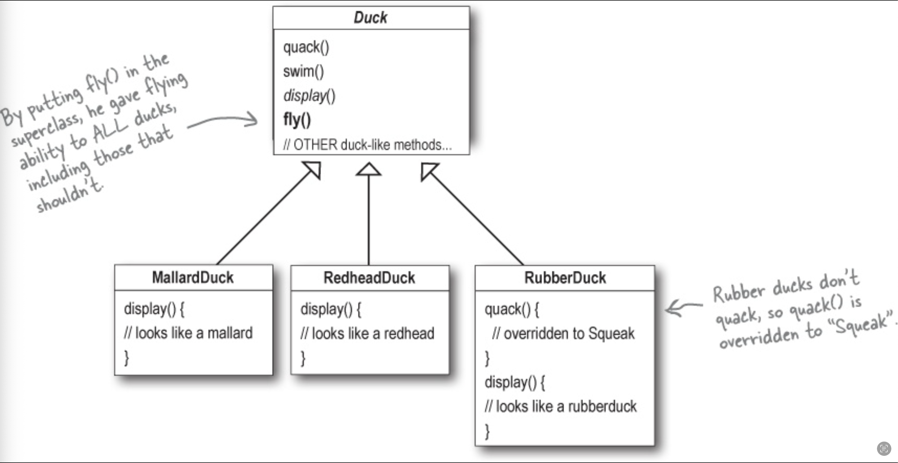
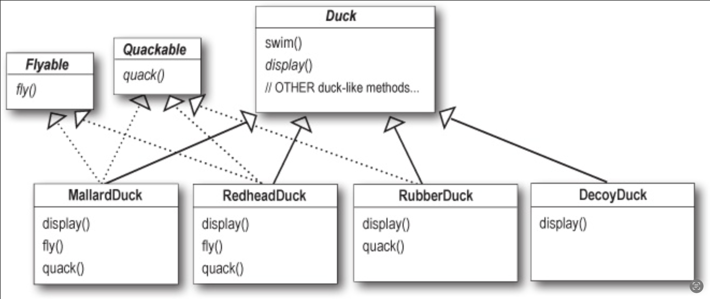
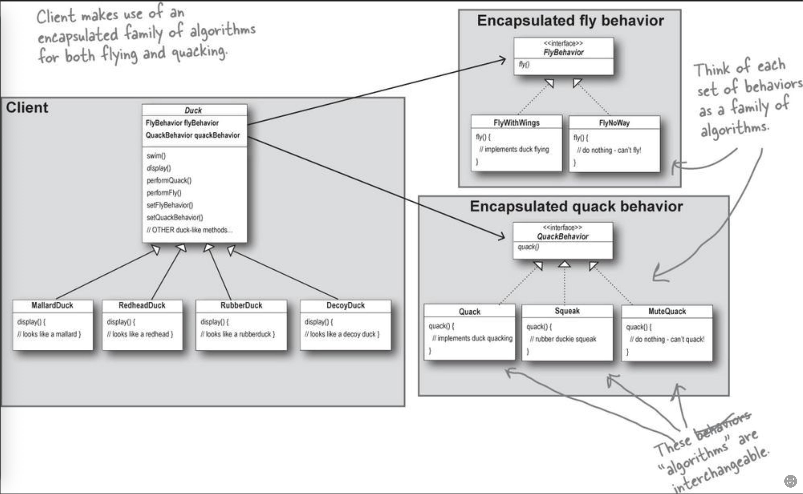
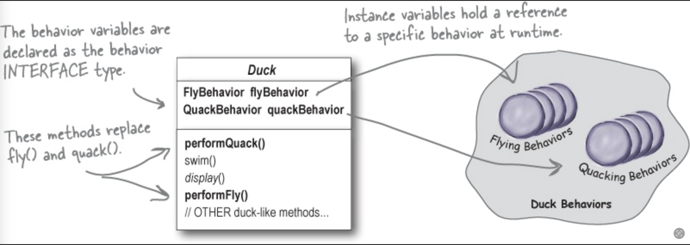

## Bài toán với ứng dụng SumUDuck

Giả sử bạn đang phát triển một dứng dụng có tên là SumDick. Đây là một ứng dụng đơn giản về loài vịt, ứng dụng có khả năng hiển thị hình ảnh của từng loại vịt kèm tiếng kêu và cách chúng bơi.

Hệ thống được thiết kế chuẩn theo kỹ thuật OOP với một class **Duck** là lớp cha và tất cả các loại vịt khác sẽ kế thừa từ nó.



Bây giờ chúng ta cần mở rộng chương trình, chúng ta cần một phương thức bay. 

### Tiếp cận theo hướng kế thừa

Cách đơn giản nhất là chúng ta sẽ thêm một thương thức **fly()** vào trong class **Duck** và khi đó các lớp con sẽ kế thừa nó.

Đây là điều tuyệt với nhất của kỹ thuật OOP, cho đến khi các lớp vịt mới xuất hiện như class **RubberDuck** (vịt đồ chơi làm bằng cao su) lớp vịt này thực thế không thể bay, việc này dẫn đến lỗi logic trong thiết kế chương trình.



Với cách tiếp cận này khi chương trình chạy runtime sẽ có các nhược điểm sau:

- Code sẽ bị duplicate khi chúng ta override lại hành động fly của class Dick trong các lớp kế thừa.
- Khó thay đổi những hành động khi chương trình chạy.
- Việc thay đổi một hành động trong lớp Duck sẽ ảnh hưởng đến toàn bộ các lớp khác.
- Tốn nhiều thời gian để maintainer, và phạm vi test sẽ rất lớn khi có sự thay đổi xãy ra.

### Tiếp cận theo hướng interface

Một cách tiếp cận khác là sử dụng interface, chúng ta sẽ tách các hành động thành những interface khác nhau như **Quackable**, **Flyable**. Các lớp vịt sẽ kế thừa và triển khai những hành động trong từng interface.



Với cách tiếp cận này, tất cả các subclasses sẽ phải triển khai Flyable và Quackable, nó chỉ giải quyết được một phần vấn đề (không cho class **RubberDuck** bay), nhưng chương trình sẽ có các nhược điểm sau:

- Duplicate code khi chúng ta triển khai Flyable, Quackable cho từng subclass.
- Ác mộng với việc maintainer sau này, vì khi một hành động thay đổi nghiệp vụ thì chúng ta sẽ phải đi sửa lại tất cả các subclass triển khai hành động đó.
- Và việc thêm một hành động mới thì chúng ta cũng sẽ phải đi viết mới code trên tất cả các subclass triển khai hành động đó.

Chúng ta đều thấy được nhược điểm không tái sử dụng được mã nguồn do duplicate code, khó khăn cho việc maintainer, và mở rộng một tính năng mới cho chương trình. Do đó Strategy Pattern được sinh ra để giải quyết những hạn chế của hai cách tiếp cận trên.

---

## Strategy Pattern là gì?

**Strategy Pattern** định nghĩa một họ những giải thuật, mỗi giải thuật sẽ được đóng gói riêng từng cái một, và các giải thuật này có khả năng hoán đổi cho nhau. Trong Strategy Pattern các giải thuật thay đổi một cách độc lập với client sử dụng chúng.

Ví dụ như bạn có một client cần sắp xếp một danh sách, khi áp dụng Strategy Pattern chúng ta sẽ định nghĩa một họ các giải thuật sort và client có thể tuỳ ý hoán đổi giải thật sort khi sử dụng cho từng bài toán cụ thể.

---

## Triển khai strategy Pattern cho SumDuck

### Mã nguồn

Bạn có thể tham khảo mã nguồn [tại đây](https://github.com/thehappycode/Java/tree/strategy-pattern)

### Mô hình



### Bước 1: Xác định và đóng gói.

Để triển khai strategy pattern điều đầu tiên là chúng ta phải xác định được những hành động, giải thuật thường xuyên thay đổi, sau đó tách và đóng gói chúng riêng ra. Như ví dụ bên trên chúng ta có thể xác định hai hành động là Flyable và Quackable.



```java

public abstract class BaseDuck {
  
  // TODO: Tạo biến flyBehavior. Uỷ quyền (delegate) cho interface FlyBehavior.
  protected FlyBehavior flyBehavior;

  // TODO: Tạo biến quackBehavior.
  protected QuackBehavior quackBehavior;

  public BaseDuck() {

  }

  // Khởi tạo đối tượng. Uỷ quyền (delegate) cho interface QuackBehavior.
  public BaseDuck(FlyBehavior flyBehavior, QuackBehavior quackBehavior){
    this.flyBehavior = flyBehavior;
    this.quackBehavior =  quackBehavior;
  }

  public void performFly(){
    flyBehavior.fly();
  }

  public void performQuack(){
    quackBehavior.quack();
  }

  public abstract void display();

}

```

### Bước 2: Định nghĩa interface cho hành động và tạo những class triển khai cho từng hành động cụ thể.

Tiếp theo chúng ta cần phải định nghĩa những interface cho những hành động được xác định ở bước 1, và tạo những class triển khai cho từng hành động cụ thể.

```java

// TODO: Định nghĩa hành động fly cho interface FlyBehavior.
public interface FlyBehavior {
  void fly();
}

// TODO: Triển khai FlyWithWings 
public class FlyWithWings implements FlyBehavior {
  public void fly(){
    System.out.println("-> I'm fly with wings");
  }

// TODO: Triển khai FlyNoWay.
public class FlyNoWay implements FlyBehavior { 
  public void fly() {
    System.out.println("-> I can't fly");
  }
  
}

// TODO: Tương tự định nghĩa interface, và triển khai cho QuackBehivior
// ...

}

```

### Bước 3: Định nghĩa đối tượng

Tại đây chúng ta sẽ định nghĩa những đối tượng cụ thể kế thừa từ abstract class Duck, như Mallarđuck, rubberDuck

```java

// TODO: Định nghĩa MallardDuck
public class MallardDuck extends BaseDuck {

  public MallardDuck(){
    flyBehavior = new FlyWithWings();
    quackBehavior = new Quack();
  }

  public MallardDuck(FlyBehavior flyBehavior, QuackBehavior quackBehavior){
      super(flyBehavior, quackBehavior);
  }

  @Override
  public void display(){
    System.out.println("-> display MallardDuck");
  }
}


// TODO:  Định nghĩa RubberDuck
public class RubberDuck extends BaseDuck {

    public RubberDuck(){
        super();
        flyBehavior = new FlyNoWay();
        quackBehavior = new Quack();
    }

    public RubberDuck(FlyBehavior flyBehavior, QuackBehavior quackBehavior){
        super(flyBehavior, quackBehavior);
    }

    @Override
    public void display() {
        System.out.println("-> display RubberDuck");
    }
}

```


### Bước 3: Client sử dụng stragegy pattern.

Client có thể sử dụng stragegy pattern một cách linh hoạt, mà không phụ thuộc vào những đối tượng mới, hoặc hành động mới nếu phát sinh. Do đó chương trình rất dễ mở rộng.

```java

public class SumDuck {
  public static void main(String[] args){
    System.out.println("-> Welcome to Sum Duck program");
    System.out.println();

    BaseDuck mallardDuck = new MallardDuck();
    mallardDuck.display();
    mallardDuck.performFly();
    mallardDuck.performQuack();

    System.out.println();

    BaseDuck rubberDuck = new RubberDuck();
    rubberDuck.display();
    rubberDuck.performFly();
    rubberDuck.performQuack();

  }
}

```

### Bước 4: Mở rộng chương trình

Điều cơ bản nhất khi mở rộng một chương trình, sẽ là thêm một hành vi, hoặc một đối tượng mới vào chương trình. Điều này được thực hiện rất dễ khi sử dụng strategy pattern. Giả sử bây giờ chúng ta cần thêm một hành vi im lặng MuteQuack và một đối tượng vịt mới là modelDuck vào ví dụ bên trên thì chúng ta sẽ làm như sau:

#### Thêm một hành vi MuteQuack 

```java

// TODO: Thêm một class MuteQuack 
public class MuteQuack implements QuackBehavior {
    public void quack(){
      System.out.println("-> Silence");
    }  
}

```

#### Thêm một đối tượng modelDuck

```java

// TODO: Thêm một đối tượng MuteQuack
public class ModelDuck  extends BaseDuck {

    public ModelDuck(){
        super();
        flyBehavior = new FlyNoWay();
        quackBehavior = new MuteQuack();
    }

    public ModelDuck(FlyBehavior flyBehavior, QuackBehavior quackBehavior){
        super(flyBehavior, quackBehavior);
    }

    @Override
    public void display() {
        System.out.println("-> display ModelDuck");
    }
}

```

### Client sẽ có code như sau

```java

public class SumDuck {
  public static void main(String[] args){
    System.out.println("-> Welcome to Sum Duck program");
    System.out.println();

    BaseDuck mallardDuck = new MallardDuck();
    mallardDuck.display();
    mallardDuck.performFly();
    mallardDuck.performQuack();

    System.out.println();

    BaseDuck rubberDuck = new RubberDuck();
    rubberDuck.display();
    rubberDuck.performFly();
    rubberDuck.performQuack();

    System.out.println();

    FlyBehavior flyBehavior = new FlyNoWay();
    QuackBehavior quackBehavior = new Squeak();
    BaseDuck modelDuck = new ModelDuck(flyBehavior, quackBehavior);
    modelDuck.display();
    modelDuck.performFly();
    modelDuck.performQuack();
  }
}

```

---

## Tổng kết

Strategy pattern được sử dung khi bạn muốn chương trình có thể mở rộng dễ dàng, có sự linh hoạt khi hoán đổi được các giải thuật trong quá trình chạy runtime.

Điểm mấu chốt để triển khai tốt pattern này là xác định, cô lập, và đóng gói những hành vi thường xuyên thay đổi.
