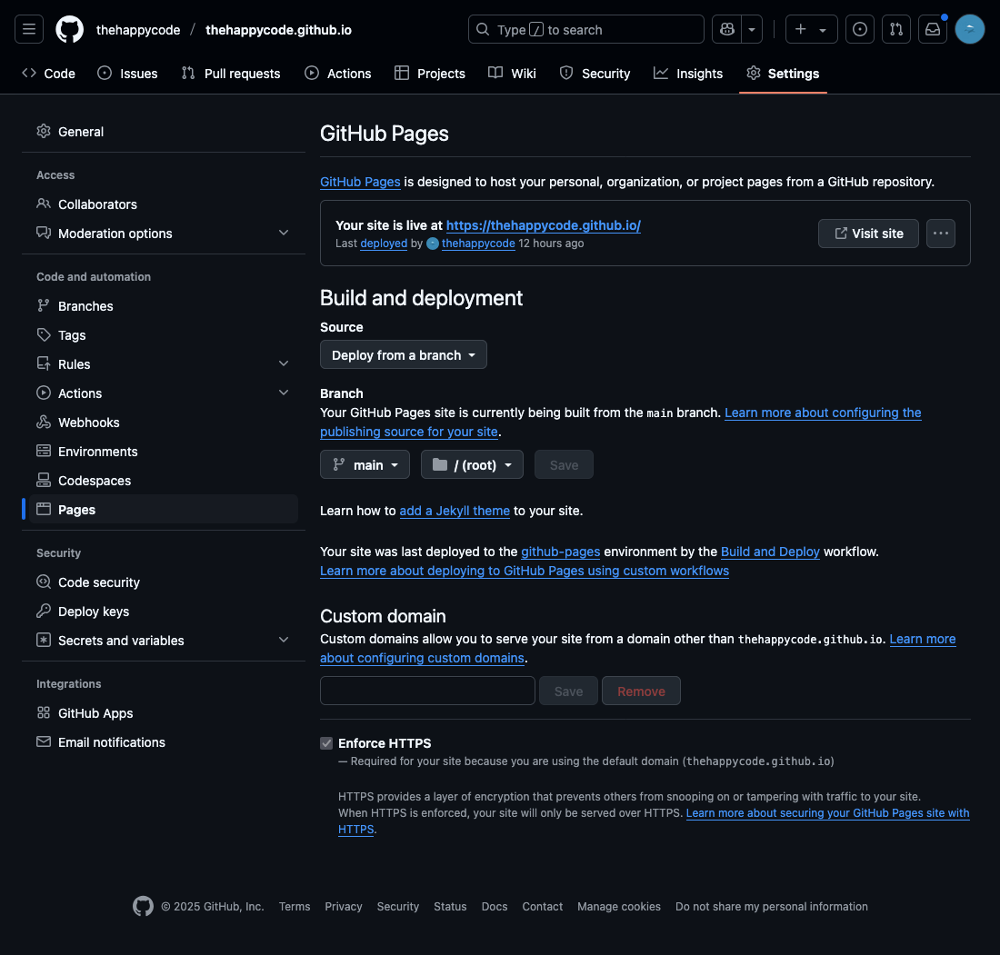

Bạn đang có ý định tạo một **Blog** nhầm chia sẽ kiến thức, hiện nay có khá nhiều nền tảng hỗ trợ người dùng xây dựng một **Blog** như: WordPress, Blogspot, Medium, ... Trong bài viết này, tôi xin giới thiệu thêm một nền tảng hoàn toàn miễn phí nữa đó là **GitHub Pages** kết hợp với **Jekyll**.

**Let's go** 🏃🏻‍➡️

## GitHub Pages là gì?

**GitHub Pages** là một dịch vụ miễn phí của GitHub, giúp bạn host trực tiếp các trang web tĩnh từ repository.

**GiHub Pages** hỗ trợ sẵn các Actions để tự động build và deploy khi bạn push một commit mới lên repository.

Ngoài ra, **Github Pages** đã được tích hợp **Jekyll**, **Markdown** và các theme có sẵn để bạn viết và đăng bài post vô cùng dễ dàng.

---

## Jekyll là gì?

**Jekyll** là một **Static Site Generator** (trình tạo trang tĩnh) được viết bằng  Ruby. Giúp bạn chuyển đổi plain text vào trong static website và blog mà không cần Backend.

**Jekyll** hỗ trợ **Markdown**, **Liquid** (template engine), **SCSS**. Bạn có thể sử dụng theme và tuỳ chỉnh giao diện dễ dàng.

---

## Tạo một Blog

### Clone/Fork theme và cấu hình ứng dụng

Bạn có thể xem cách tạo mới một **Jekyll** site [tại đây](https://jekyllrb.com/docs/).

Cá nhân tôi thì Fork theme [chirpy-starter](https://github.com/cotes2020/chirpy-starter) bằng cách click vào button `Use this template` sau đó chọn `Create a new repository`.

### Host một website từ Repository bằng GitHubPages

Như đã trình bày bên trên, bây giờ chúng ta sẽ thực hiện host một website từ repository bằng GitHub Pages như sau:

- **Bước 1:** Trước tiên mở trình duyệt và truy cập đến [GitHub](http://github.com).
- **Bước 2:** Chọn repository bạn vừa clone/fork.
- **Bước 3:** Chọn tab `Settings` -> `Pages`.
- **Bước 4:** Tại phần `Build and deployment`. Bạn cần thực hiện như sau:
  - **Source**: Option này tôi lựa chọn `Deploy from a branch`, để Actions tự động build và deploy lại khi bạn push một commit mới lên. Nếu muốn custom Actions thì bạn cần chọn option `GitHub Actions`.
  - **Branch**: Option này bạn cần chỉ ra branch và thư mục để deployment.
  - **Save**: Lưu lại cấu hình và kích hoạt quá trình `Build and deployment`

Hình ảnh sau khi hoàn thành cấu hình **GitHub Pages**.


### Kiểm tra Actions

Để kiểm tra trạng thái của Actions thì bạn chọn tab `Actions`. Bạn sẽ thấy danh sách worker runs, click vào một item để kiểm tra tình trạng, cũng như lỗi nếu có.

Trong trường hợp không có lỗi xãy ra thì bạn đã build thành công một Blog trên GitHub Pages rồi đó. Thế thì ở đây sẽ có một câu hỏi lớn đặt ra là vì sao lại pải cài đặt thêm  **Jekyll**?

### Cài đặt Jekyll chạy trên Docker

Trong phạm vi bài viết này tôi sẽ hướng dẫn bạn cài đặt **Jekyll** chạy trên **Docker**. Trong trường hợp bạn muốn cài trực tiếp trên máy local thì xem hướng dẫn [tại đây](https://jekyllrb.com/docs/installation/)

#### Tạo một `Dockerfile`

Bạn cần tạo một `Dockerfile` và copy nội dung bên dưới vào, hoặc bạn có thể pull từ **DockerHub** theo lệnh `docker pull thehappycode/jekyll-blog`

```docker
# syntax=docker/dockerfile:1
FROM ubuntu:24.04

# "Get the latest APT packages"
RUN apt-get update

# "Cài đặt Ruby và các gói yêu cầu khác
RUN apt-get -y install \
    git \
    ruby-full \
    build-essential \
    zlib1g-dev

# " Cấu hình gem PATH
RUN echo '# Install Ruby Gems to ~/gems' >> ~/.bashrc
RUN echo 'export GEM_HOME="$HOME/gems"' >> ~/.bashrc
RUN echo 'export PATH="$HOME/gems/bin:$PATH"' >> ~/.bashrc
RUN bash -c "source ~/.bashrc"

# "Cài đặt Jekyll và Bundler
RUN gem install jekyll bundler

# "Tạo WORKDIR
WORKDIR /app

# COPY source code vào /app trong container
COPY . /app

# Bundle install các dependencies
RUN bundler install

# Mở port 4000
EXPOSE 4000

# Chạy Jekyll khi khởi động container
CMD ["bundle", "exec", "jekyll", "serve", "--livereload", "--trace", "--host", "0.0.0.0"]

```

#### Tạo một `image`

Mở Terminal và di chuyển đến thư mục chứa `Dockerfile` sau đó chạy sau để build một image.

```docker
docker build -t jekyll-blog . 
```
### Tạo một `container`

Mở Terminal và di chuyển đến thư mục chứa repository, sau đó chạy lệnh sau để tạo một container.

- Trường hợp bạn pull image từ DockerHub 
```docker
% docker run --name blog -dp 127.0.0.1:4000:4000 --mount type=bind,src=.,target=/app thehappycode/jekyll-blog
```

- Trường hợp bạn build image
```docker
docker run --name blog -dp 127.0.0.1:4000:4000 --mount type=bind,src=.,target=/app jekyll-blog
```

### Sửa file cấu hình `_config.yml`

### Tạo bài post đầu tiên `2025-03-16-hello-world.md`
```md
---
title: "Hello World"
date: 2025-03-16 02:20:00 +0700
categories: [Jekyll]
tags: [Jekyll]
---

# Hello World

Hello World this my personal blog.
Test jekyll-watch => Good job
```
---

### Thay đổi **avatar**

### Thay đổi **favicon**

### Thêm `jekyll-watch`

### Chỉnh sửa theme

---

## Chúc mừng
Xin chúc mừng bạn đã hoàn thành tạo một **Blog**.
Rất vui và hạnh phúc khi bạn đọc hết blog. Mong bạn có nhiều bài viết hữu ít chia sẽ kiến thức cho cộng động.
