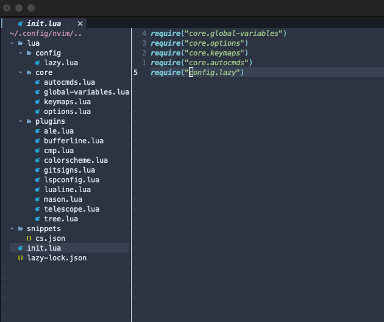

## Neovim là gì?

[Neovim](https://neovim.io/) là trình soạn thảo văn bản dựa trên **Vim** được thiết kế có khả năng mở rộng, khả năng tái sử dụng, khuyến khích người dùng tạo ra các ứng dụng và đóng góp mã nguồn mới.

---

## Cài đặt Neovim

### Windows

Đối với hệ điều hành Windowns yêu cầu Windowns 8+, các phiên bản thấp hơn sẽ không được hỗ trợ. Bạn có thể cài đặt thông qua:

#### Winget
- `winget install Neovim.Neovim`

#### Chocolatey
- `choco install neovim`

### MacOS

#### For x86_64
```
curl -LO https://github.com/neovim/neovim/releases/download/nightly/nvim-macos-x86_64.tar.gz
tar xzf nvim-macos-x86_64.tar.gz
./nvim-macos-x86_64/bin/nvim
```

#### For arm_64
```
curl -LO https://github.com/neovim/neovim/releases/download/nightly/nvim-macos-arm64.tar.gz
tar xzf nvim-macos-arm64.tar.gz
./nvim-macos-arm64/bin/nvim
```

#### Homebrew
- `brew install neovim`

### Kiểm tra

Bạn có thể sử dụng các lệnh cơ bản sau để kiểm tra **Neovim** đã cài đặt thành công chưa.

#### Kiểm tra phiên bản
- `nvim -version`

#### Kiểm tra thư mục cấu hình
- Chạy lệnh `:echo stdpath("config")` trong nvim

---

## Cấu trúc cây thư mục



Ảnh bên trên là kết quả sau khi chúng ta hoàn thành việc setup. **Neovim** sử dụng ngôn ngữ lập trình **Lua** để cấu hình các thành phần plugins. Do đó để thuận tiện cho việc thực hiện trong suốt qúa trình setup bạn có thể tham chiếu cấu trúc cây thư mục bên trên.

---

## Cấu hình file *.lua

Tôi sẽ hướng dẫn bạn cấu hình theo thứ tự từ trên xuống dưới như hình bên trên.

**Lưu ý**
Hiện tại tôi đang sử dụng ngôn ngữ `C#` nên sẽ có một số cấu hình liên quan. Nếu bạn sử dụng ngôn ngữ lập trình khác vui lòng **research** và **thay thế** bằng ngôn ngữ bạn đang sử dụng.

### /config/lazy.lua

[lazy.nvim](https://www.lazyvim.org/) là plugin manager hiện đại dùng cho Neovim. Lazy có một số tính năng nổi bật sau:

- Quản lý tất cả Neovim plugins bằng UI.
- Tự động kiểm tra update của plugins.
- Thời gian khởi động cực nhanh với automatic caching và kết hợp bytecode của **Lua** modules.
- Thực hiện bất đồng bộ (async) để cải tiến hiệu năng.
- Và nhiều tính năng khác, bạn có thể tìm hiểu thêm trên trang chủ.

Tạo file `lazy.lua` và copy nội dung cấu hình bên dưới vào.

```lua
local lazypath = vim.fn.stdpath("data") .. "/lazy/lazy.nvim"
if not (vim.uv or vim.loop).fs_stat(lazypath) then
  local lazyrepo = "https://github.com/folke/lazy.nvim.git"
  local out = vim.fn.system({ "git", "clone", "--filter=blob:none", "--branch=stable", lazyrepo, lazypath })
  if vim.v.shell_error ~= 0 then
    vim.api.nvim_echo({
      { "Failed to clone lazy.nvim:\n", "ErrorMsg" },
      { out, "WarningMsg" },
      { "\nPress any key to exit..." },
    }, true, {})
    vim.fn.getchar()
    os.exit(1)
  end
end
vim.opt.rtp:prepend(lazypath)

-- Setup lazy.nvim
require("lazy").setup({
  spec = {
    -- import your plugins
    { import = "plugins" },
  },
  -- Configure any other settings here. See the documentation for more details.

  -- automatically check for plugin updates
  checker = { enabled = true },
})
```

Trong trường hợp bạn không muốn sử dụng Lazy thì bạn có thể sử dụng **packer.nvim**, **vim-plug** để quản lý các plugins.

### /core/autocmds.lua

`AutoCommands` cho phép bạn tự động thực hiện một hành động khi một sự kiện nhất định xảy ra. Nó giúp bạn tuỳ chỉnh môi trường làm việc một cách linh hoạt hơn.

Tạo một file `autocmds.lua` và copy nội dung cấu hình bên dưới vào

```lua
-- Tự động format khi save file
vim.api.nvim_create_autocmd("BufWritePre", {
  pattern = "*.cs",
  callback = function()
    vim.lsp.buf.format()
  end,
})

-- Reload Neovim khi sửa các file cấu hình
vim.api.nvim_create_autocmd("BufWritePost", {
  pattern = "init.lua",
  command = "source <afile>",
})

-- Highlight khi copy
vim.api.nvim_create_autocmd("TextYankPost", {
  pattern = "*",
  callback = function()
    vim.highlight.on_yank({ timeout = 300 })
  end,
})
```

### /core/global-variables.lua

Tạo file `global-variables.lua` để cấu hình các biến toàn cục của **Neovim**.

```lua
-- Cài đặt phím leader. Mặc định là phím .\
vim.g.mapleader = ' '
vim.g.maplocalleader = ' '

-- Disable netrw. netrw là một file explore mặc định của neovim
vim.g.loaded_netrw = 1
vim.g.loaded_netrwPlugin = 1
```
### /core/keymaps.lua

Tạo file `keymaps.lua` để cấu hình danh sách phím tắt tuỳ chỉnh theo nhu cầu của bạn.

```lua
-- Cài đặt phím tắt.
local map = vim.keymap.set

-- Lưu file nhanh
map("n", "<leader>sf", ":w<CR>", { desc = "Save file" })

-- Đóng buffer
map("n", "<leader>q", ":bd<CR>", { desc = "Close buffer" })

-- Chuyển nhanh giữa các buffer
map("n", "<Tab>", ":bnext<CR>", { desc = "Next buffer" })
map("n", "<S-Tab>", ":bprevious<CR>", { desc = "Previous buffer" })

-- Format code (sẽ liên kết với LSP)
map("n", "<leader>fc", vim.lsp.buf.format, { desc = "Format code" })

-- Đóng buffer hiện tại
map("n", "<leader>bc", ":bd<CR>", { noremap = true, silent = true }) 

-- Toggle Pin Buffer
map("n", "<leader>bp", ":BufferLineTogglePin<CR>", { noremap = true, silent = true })
```

### /core/options.lua

Tạo file `options.lua` để thiết lập các tuỳ chỉnh cho **Neovim**

```lua
-- Tuỳ chỉnh cơ bản cho Neovim
local opt = vim.opt

-- Hiển thị số dòng
opt.number = true
opt.relativenumber = true

-- Tự động indent
opt.expandtab = true
opt.shiftwidth = 2
opt.tabstop = 2

-- Tìm kiếm không phân biệt hoa thường
opt.ignorecase = true
opt.smartcase = true

-- Bật mouse
opt.mouse = "a"

-- Tăng tốc độ cập nhật
-- opt.updatetime = 300

-- Highlight dòng hiện tại
opt.cursorline = true

-- optionally enable 24-bit colour
vim.opt.termguicolors = true
```

### /plugins/ale.lua

[ale](https://github.com/dense-analysis/ale?tab=readme-ov-file) (Asynchronous Lint Engine) là một plugin cung cấp linting (kiểm tra syntax và lỗi ngữ nghĩa) khi bạn edit file text và tương tác với [Language Server Protocal](https://langserver.org/) client.

Tạo một file `ale.lua` và copy nội dung cấu hình bên dưới vào:

```lua
return {
    'dense-analysis/ale',
    config= function()
        -- Configuration goes here.
        vim.g.ale_sign_error = '•'
        vim.g.ale_sign_warning = '•'
        vim.g.ale_sign_info = '·'
        vim.g.ale_sign_style_error = '·'
        vim.g.ale_sign_style_warning = '·'

        vim.g.ale_linters = {
            cs = { 'OmniSharp' } // Language Server Protocal
        }
    end
}
```

### /plugins/bufferline.lua

Một trình soạn thảo văn bản thì không thể thiếu việc sử dụng nhiều buffer cùng một lúc. Bạn có thể hiểu buffer sẽ tương ứng với một file đang mở trong bộ nhớ. [bufferline.nvim](https://github.com/akinsho/bufferline.nvim?tab=readme-ov-file#picking) được built nhầm mục đích đáp ứng yêu cầu đó.

Tạo một file `bufferline.lua` và copy nội dung bên dưới vào:

```lua
return {
  "akinsho/bufferline.nvim",
  dependencies = { "nvim-tree/nvim-web-devicons" },
  version = "*",
  opts = {
    options = {
      mode = "buffers",
      diagnostics = "nvim_lsp",
      always_show_bufferline = true,
    },

  }
}
```

### /plugins/cmp.lua

[nvim-cmp](https://github.com/hrsh7th/nvim-cmp) là một engine hoàn thành mã nguồn dành cho **Neovim**. Nó giúp hiển thị các gợi ý khi bạn viết code.

Tạo file `cmp.lua` và copy nội dung bên dưới vào:
```lua
return {
    "hrsh7th/nvim-cmp",
    dependencies = {
        "hrsh7th/cmp-nvim-lsp",
        "hrsh7th/cmp-buffer",
        "hrsh7th/cmp-path",
        "hrsh7th/cmp-vsnip",
        "hrsh7th/vim-vsnip"
    },
    config = function()     
        local cmp = require("cmp")

        -- Thêm cấu hình vim.g.vsnip_snippet_dirs
        local snippets_path = vim.fn.stdpath("config") .. "/snippets"
        vim.g.vsnip_snippet_dir = vim.fn.expand(snippets_path)

        cmp.setup({
            snippet = {
                -- REQUIRED - you must specify a snippet engine
                expand = function(args)
                    vim.fn["vsnip#anonymous"](args.body) -- For `vsnip` users. 
                end
            },
            mapping = cmp.mapping.preset.insert({
                ['<C-Space>'] = cmp.mapping.complete(),
                ["<Tab>"] = cmp.mapping.select_next_item(),
                ["<S-Tab>"] = cmp.mapping.select_prev_item(),
                ['<C-i>'] = cmp.mapping.abort(),
                ["<CR>"] = cmp.mapping.confirm({ select = true })
            }),
            sources = cmp.config.sources({
                { name = "nvim_lsp" },
                { name = "buffer" },
                { name = "path" },
                { name = 'vsnip' }
            },{
                { name = 'buffer' },
            })
        })

        -- Liên kết LSP với autocompletion
        local capabilities = require("cmp_nvim_lsp").default_capabilities()
        local lspconfig = require("lspconfig")
        lspconfig.omnisharp.setup({
            cmd = { "omnisharp" },
            root_dir = lspconfig.util.root_pattern("*.csproj", "*.sln"),
            capabilities = capabilities, -- Thêm dòng này
        })
    end
}
```

### /plugins/colorscheme.lua

Một đặc điểm vô cùng thú vị của **Neovim** đó là [theme](https://dotfyle.com/neovim/colorscheme/trending)  bạn có thể tuỳ chỉnh hoặc lựa chọn theme theo phong cách, cá tính của chính mình.

Tạo một file `colorscheme.lua` và copy nội dung cấu hình bên dưới vào.

```lua
return {
    "shaunsingh/nord.nvim",
    lazy = false, -- make sure we load this during startup if it is your main colorscheme
    priority = 1000, -- make sure to load this before all the other start plugins
    config = function()
      -- load the colorscheme here
        vim.cmd([[colorscheme nord]])
    end
}
```

Tôi đang dùng theme `shaunsingh/nord.nvim`. Nếu bạn dùng theme khác thì chỉ cần đổi tên theme.

### /plugins/gitsigns.lua

[gitsigns.nvim](https://github.com/lewis6991/gitsigns.nvim) là một plugin cho **Neovim** giúp hiển thị thông tin và các tính năng của git trong quá trịnh soản thảo văn bản.

Tạo file `gitsigns.lua` và copy nội dung bên dưới vào:

```lua
return {
  "lewis6991/gitsigns.nvim",
  opts = {
    on_attach = function(bufnr)
        local gitsigns = require('gitsigns')

        local function map(mode, l, r, opts)
            opts = opts or {}
            opts.buffer = bufnr
            vim.keymap.set(mode, l, r, opts)
        end

        -- Navigation
        map('n', ']c', function()
            if vim.wo.diff then
                vim.cmd.normal({']c', bang = true})
            else
                gitsigns.nav_hunk('next')
            end
        end)

        map('n', '[c', function()
            if vim.wo.diff then
                vim.cmd.normal({'[c', bang = true})
            else
                gitsigns.nav_hunk('prev')
            end
        end)

        -- Actions
        map('n', '<leader>hs', gitsigns.stage_hunk)
        map('n', '<leader>hr', gitsigns.reset_hunk)

        map('v', '<leader>hs', function()
            gitsigns.stage_hunk({ vim.fn.line('.'), vim.fn.line('v') })
        end)

        map('v', '<leader>hr', function()
            gitsigns.reset_hunk({ vim.fn.line('.'), vim.fn.line('v') })
        end)

        map('n', '<leader>hS', gitsigns.stage_buffer)
        map('n', '<leader>hR', gitsigns.reset_buffer)
        map('n', '<leader>hp', gitsigns.preview_hunk)
        map('n', '<leader>hi', gitsigns.preview_hunk_inline)

        map('n', '<leader>hb', function()
            gitsigns.blame_line({ full = true })
        end)

        map('n', '<leader>hd', gitsigns.diffthis)

        map('n', '<leader>hD', function()
            gitsigns.diffthis('~')
        end)

        map('n', '<leader>hQ', function() gitsigns.setqflist('all') end)
        map('n', '<leader>hq', gitsigns.setqflist)

        -- Toggles
        map('n', '<leader>tb', gitsigns.toggle_current_line_blame)
        map('n', '<leader>td', gitsigns.toggle_deleted)
        map('n', '<leader>tw', gitsigns.toggle_word_diff)

        -- Text object
        map({'o', 'x'}, 'ih', gitsigns.select_hunk)
    end
  }
}
```

### /plugins/lspconfig.lua

[nvim-lspconfig](https://github.com/neovim/nvim-lspconfig) là một plugin dành cho **Neovim**, giúp bạn cấu hình và kết nối với **Language Server Protocal** một cách dễ dàng hơn.

Tạo file `lspconfig.lua` và copy nội dung cấu hình bên dưới vào:

```lua
return {
    "neovim/nvim-lspconfig",
    config = function()
      
        local lspconfig = require("lspconfig")
        lspconfig.omnisharp.setup({
            cmd = { "omnisharp" }, -- Đường dẫn tới OmniSharp
            root_dir = lspconfig.util.root_pattern("*.csproj", "*.sln"), -- Nhận diện dự án .NET
        })

    end
}
```


### /plugins/lualine.lua

[lualine.nvim](https://github.com/nvim-lualine/lualine.nvim) là một plugin thanh trạng thái dành cho **Neovim** được viết bằng ngôn ngữ **Lua**. lualine có các ưu điểm sau:
- Có hiệu năng tốt hơn khi so sánh với các plugin khác như **lightline**, **airline**.
- Dễ dàng tuỳ chỉnh cấu hình.
- Cung cấp rất nhiều theme để bạ lựa chọn.

Tạo một file `lualine.lua` copy nội dung cấu hình bên dưới vào:

```lua
return {
    'nvim-lualine/lualine.nvim',
    dependencies = { 'nvim-tree/nvim-web-devicons' },
    opts = function()
        options = {
            theme = 'codedark',
            section_separators = {left = '|', right = '|'},
            -- component_separators = ''
        }
    end
}
```

### /plugins/mason.lua

[mason.nvim](https://github.com/williamboman/mason.nvim) là một trình quản lý **LSP**, **DAP**, **Linters**, **Formatter** dành cho **Neovim**. Giúp bạn quản lý và cài đặt các công cụ một cách dễ dàng mà không cần phải cài đặt thủ công.

Tạo file `mason.lua` copy nội dụng cấu hình bên dưới vào:

```lua
return {
    "williamboman/mason.nvim",
    dependencies = {"williamboman/mason-lspconfig.nvim"},
    config = function() 
        require("mason").setup({
            ui = {
                icons = {
                    package_installed = "✓",
                    package_pending = "➜",
                    package_uninstalled = "✗"
                }
            }
        })
        require("mason-lspconfig").setup({
            ensure_installed = { "omnisharp" } -- Cài OmniSharp
        })

    end
}
```

### /plugins/telescope.lua

[telescope.nvim](https://github.com/nvim-telescope/telescope.nvim) là một plugin mạnh mẽ dành cho **Neovim**, giúp bạn tìm kiếm tập tin, buffer, lệnh và nhiều thứ khác một cách nhanh chóng và hiệu quả. Telescope được mở rộng từ **fuzzy finder** (tìm kiếm mờ) để giúp bạn tìm kiếm mà không cần nhập chính xác toàn bộ từ khoá.

Tạo một file `telescope.lua` và copy nội dung cấu hình bên dưới vào

```lua
return {
    'nvim-telescope/telescope.nvim', tag = '0.1.8',
    dependencies = { 'nvim-lua/plenary.nvim' },
    opts = function()
        local builtin = require('telescope.builtin')
        vim.keymap.set('n', '<leader>ff', builtin.find_files, { desc = 'Telescope find files' })
        vim.keymap.set('n', '<leader>fg', builtin.live_grep, { desc = 'Telescope live grep' })
        vim.keymap.set('n', '<leader>fb', builtin.buffers, { desc = 'Telescope buffers' })
        vim.keymap.set('n', '<leader>fh', builtin.help_tags, { desc = 'Telescope help tags' })
    end
}
```

### /plugins/tree.lua

[nvim-tree](https://github.com/nvim-tree/nvim-tree.lua) là một plugin **file explore** (trình quản lý tập tin) dành cho **Neovim**, giúp bạn quản lý thư mục và tập tin một cách trực quan và hiệu quả, thay cho **netrw** mặc định của Vim.

Tạo một file `tree.lua` và copy nội dụng cấu hình bên dưới vào:

```lua
return {
    "nvim-tree/nvim-tree.lua",
    version = "*",
    lazy = false,
    dependencies = {
        "nvim-tree/nvim-web-devicons",
    },
    opts = function()
        on_attach = function(bufnr)
            local api = require "nvim-tree.api"

            local function opts(desc)
                return { 
                    desc = "nvim-tree: " .. desc,
                    buffer = bufnr,
                    noremap = true,
                    silent = true,
                    nowait = true
                }
            end

            -- default mappings
            --  api.config.mappings.default_on_attach(bufnr)
        end

        local keymap = vim.keymap
        
        -- Đóng, mở NvimTree
	    keymap.set('n', '<leader>tt', ':NvimTreeToggle<CR>')

        -- Chuyển sang NvimTree
        vim.keymap.set('n', '<leader>tf', ':NvimTreeFocus<CR>', { noremap = true, silent = true })

        -- Chuyển sang buffer edit
        vim.keymap.set('n', '<leader>tb', ':wincmd p<CR>', { noremap = true, silent = true })
    end,

    update_focused_file = {
    	enable = true, -- tự động highlight file đang mở
		update_cwd = true, -- cập nhật thư mục làm việc hiện tại
  	}
}
```

### /snippets/cs.json

File `cs.json` là các snippets được cấu hình trong `/plugins/cmp.lua`. Cho phé bạn tự định nghĩa các template code theo ý mình.

Tạo một file `/snippets/cs.json` và copy nội dung bên dưới vào:

```json
{
    "ctor": {
        "prefix": "ctor",
        "body": [
            "public ${1:ClassName}()",
            "{",
            "   $0",
            "}"
        ],
        "description": "Create a constructor"
    },
    "prop": {
        "prefix": "prop",
        "body": "public ${1:string} ${2:PropertyName} { get; set; }",
        "description": "Define a public property"
    },
    "method": {
        "prefix": "method",
        "body": [
            "public ${1:void} ${2:MethodName}(${3:string param})",
            "{",
            "   $0",
            "}"
        ],
        "description": "Define a method"
    }
}
```

### init.lua

File `init.lua` trong **Neovim** là file cấu hình chính được chạy đầu tiên khi khởi động. Chúng ta sử dụng file `init.lua` để tải các file:

- `global-variables.lua`
- `options.lua`
- `keymaps.lua`
- `autocmds.lua`
- `lazy.lua`

Tạo file `init.lua` và copy nội dung bên dưới vào.

```lua
require("core.global-variables")
require("core.options")
require("core.keymaps")
require("core.autocmds")
require("config.lazy")
```

---

## Chúc mừng

Xin chúc mừng bạn đã setup thành công một IDE cho chính mình. Bạn có thể cấu hình thêm các plugins để hỗ trợ cho công việc. Nếu bạn là một lập trình viên thì cần phải plugins thêm **lspconig** và ngôn ngữ bạn đã sử dụng.

