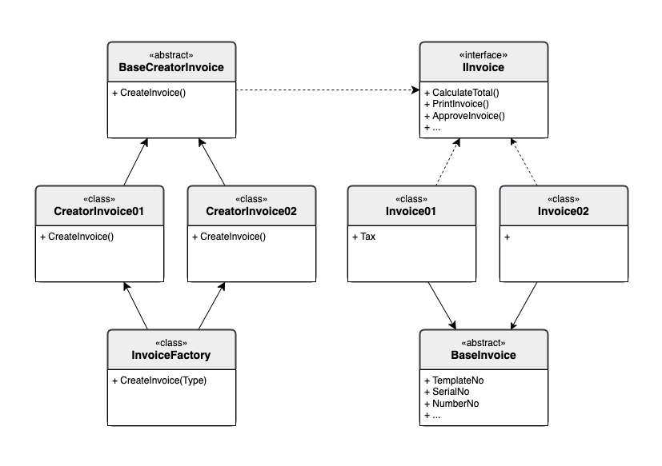

## Intent

**Factory Method** là một creational design patterns cung cấp một interface dành cho việc tạo đối tượng trong superclass, nhưng cho phép subclasses thay thế kiểu đối tượng khi chúng được tạo.

---

## Problem

Hãy tưởng tượng bạn tạo một ứng dụng quản lý logistics. Phiên bản đầu tiên của ứng dụng chỉ hoạt động vận tải bằng trucks (xe tải), số lượng lớn code của bạn sống bên trong class `Truck`.

Sau đó ứng dụng của bạn trợ nên nổi tiếng trong cộng đồng. Mỗi ngày bạn nhận hàng tá yêu cầu từ công ty vận tải đường biển muốn kết hợp sea logistics vào trong ứng dụng của bạn.

Quá tuyệt đúng không? Nhưng vấn đề code? Hiện tại, hầu hết code của bạn đang liên kết với class `Truck`. Thêm `Ships` vào trong ứng dụng yêu cầu bạn phải thay đổi hoàn toàn code base. Hơn thế nữa, nếu sau này bạn xác định thêm một kiểu vận tải khác vào trong ứng dụng, khả năng bạn sẽ phải làm lại tất cả những thay đổi một lần nữa.

Kết quả, là bạn sẽ kết thúc với một đóng code bẩn, khó dò với các điều kiện khi phải switch hành động của ứng dụng phụ thuộc vào các đối tượng vận tải.

---

## Solution

Pattern Factory Method khuyên bạn thay thế trực tiếp việc gọi đối tượng constructor (sử dụng toán tử `new`) bằng việc gọi đến phương thức đặc biệt *factory method*. Đừng lo: đối tượng vẫn sẽ được tạo thông qua toán tử `new`, nhưng được gọi từ bên trong factory method. Những đối tượng được trả kết quả từ factory method thường được gọi là *products* 

Trước tiên chúng ta nhìn thấy một số điểm:

- Chúng ta sẽ di chuyển contructor đến một nơi khác của chương trình. Tất nhiên bạn sẽ override factory method trong một subclass và thay đổi class của product khi tạo đối tượng.

- Vấn đề trên có một giới hạn là subclass có thể trả về những kiểu dữ liệu khác nhau của products chỉ khi, những products này có chung một base class hoặc interface. Do đó, factory method phải nằm trong base class đã được khai báo từ interface mà nó kế thừa.

Ví dụ, cả hai classes `Truck` và `Ship` đều implement interface `Transport`, với phương thức khai báo là `diliver`. Mỗi một class implement sẽ có những đặc trung riêng như:

- `Truck` sẽ nhận hàng từ đất liền với phương thức `RoadLogistics`.
- `Ship` thì sẽ nhận hàng từ biển với phương thức `SeaLogistics`.

---

## Structure

1. Khai báo interface **Product**, chứa những phương thức được sử dụng chung cho tất cả đối tượng đã được tạo bởi creator và các subclasses của nó.

2. **Concrete Products** là những implements khác nhau cho những phương thức đã được khai báo trước đó trong interface **Product**.

3. Class **Creator** khai báo **Factory Method** và trả về những đối tượng sẽ được tạo mới. Điều quan trọng là kiểu đối tượng trả về của phương thức này matches với interface **Product**.
    
    Bạn có thể khai báo factory method là một `abstraction` để implement tập trung tất cả phương thức của subclasses. Một thay thế, base factory method nên return một số kiểu mặc định của product.

    Chú ý, cho dù tên là **Creator** nhưng nó không chỉ có một trách nhiệm chính là khởi tạo. Thông thường, class **Creator** còn có một số core business logic liên quan đến products. Factory method giúp tách biệt logic từ classes concrete product.

4. **Concrete Creators** sẽ `override` base factory method và sẽ trả về một kiểu **ConcreteProduct** cụ thể.

    Lưu ý rằng factory method không cần phải tạo new instances cho tất cả mọi lần. Nó có thể trả về những objects đã tồn tại từ cache, một object pool hoặc một nguồn khác.

---

## Pseudocode

Phần mã giả sau sẽ trình bày cách **Factory Method** được sử dụng để tạo phần tử UI trên nhiều nền tảng, tách rời phần client code với concrete UI classes.
  

- <u><b>Bước 1:</b></u> Chúng ta sẽ tạo một *interface* **Button** có các phương thức chung là:
  - render();
  - onClick();

- <u><b>Bước 2:</b></u> Chúng ta sẽ tạo các *concrete class* kế thừa từ **Button** là **Windowns Button** và **HTML Button**.

- <u><b>Bước 3:</b></u> Chúng ta sẽ tạo class `abstraction` **Dialog** chứa method factory-method.
  - render();
  - createButton() : **Button**

- <u><b>Bước 4:</b></u> Chúng ta sẽ tiếp tục tạo hai *concrete creator* kế thừa từ **Dialog** là **WindownsDialog** và **WebDialog** cả hai đều `override` lại phương thức createButton:
  - createButton() : **Button**

Bạn có thể tham khoả mã nguồn [tại đây](https://github.com/thehappycode/POC/tree/design-patterns/src/design-patterns/practice/creational-patterns/factory-method/DialogFactoryMethod)

---

## Invoce Factory Method

Dự án này minh họa việc sử dụng **Factory Method Design Pattern** để tạo các loại hóa đơn khác nhau trong một hệ thống quản lý hóa đơn. Mỗi loại hóa đơn được triển khai với các đặc điểm riêng biệt, như thuế, chiết khấu, hoặc phí bổ sung.

### Mục tiêu

- Tổ chức mã nguồn theo mô hình **Factory Method**.
- Tạo các loại hóa đơn khác nhau (`Invoice01`, `Invoice02`, ...) với các đặc điểm riêng.
- Dễ dàng mở rộng hệ thống bằng cách thêm các loại hóa đơn mới mà không làm thay đổi mã nguồn hiện tại.

### Kiến trúc

Dưới đây là sơ đồ UML mô tả kiến trúc của dự án:

### Các thành phần chính:

1. **`IInvoice` (Interface)**:

   - Định nghĩa các phương thức chung cho tất cả các loại hóa đơn, như `CalculateTotal()` và `ToString()`.

2. **`BaseInvoice` (Abstract Class)**:

   - Lớp cơ sở chứa các thuộc tính và phương thức chung cho tất cả các loại hóa đơn.

3. **`Invoice01`, `Invoice02` (Concrete Classes)**:

   - Các lớp cụ thể kế thừa từ `BaseInvoice` và triển khai các phương thức riêng biệt.

4. **`BaseCreatorInvoice` (Abstract Class)**:

   - Lớp cơ sở cho các lớp tạo hóa đơn (`CreatorInvoice01`, `CreatorInvoice02`).

5. **`CreatorInvoice01`, `CreatorInvoice02` (Concrete Classes)**:

   - Các lớp cụ thể triển khai phương thức `CreateInvoice()` để tạo các loại hóa đơn tương ứng.

6. **`InvoiceFactory` (Factory Class)**:
   - Lớp chịu trách nhiệm tạo các loại hóa đơn dựa trên `InvoiceType`.

### Thêm loại hóa đơn mới

- Tạo một lớp mới kế thừa từ BaseInvoice.
- Tạo một lớp Creator mới kế thừa từ BaseCreatorInvoice.
- Cập nhật InvoiceFactory để hỗ trợ loại hóa đơn mới.

Bạn có thể tham khoả mã nguồn [tại đây](https://github.com/thehappycode/POC/tree/design-patterns/src/design-patterns/practice/creational-patterns/factory-method/InvocieFactoryMethod)

---

## Applicability

### Sử dụng Factory Method khi bạn không biết trước chính xác kiểu và những phụ thuộc của đối tượng trong khi bạn code. 

Factory Method chia tách code khởi tạo và code sử dụng thật sự ra. Do đó nó dễ dàng mở rộng code khởi tạo mà không phụ thuộc vào phần code còn lại.

Ví dụ, khi bạn thêm một product mới vào ứng dụng, bạn chỉ cần tạo mới một new creator subclass và `override` factory method trong nó.

### Sử dụng Factory Method khi bạn muốn cung cấp cho người dùng thư viện hoặc framework của bạn với cách mở rộng từ thành phần bên trong.

Kế thừa có lẽ là cách mở rộng dễ dàng nhất, những hành động mặc định của thư viện hoặc framework. Nhưng làm sao để biết subclass của bạn nên được sử dụng như thế nào để thay thế các thành phần chuẩn của framework?

Giải pháp là giảm bớt code khởi tạo các thành phần trong framewrok, và đưa nó vào trong một method factory và mọi người có thể override phương thức này để mở rộng các thành phần của nó.

Cách làm việc như sau. Tưởng tượng bạn viết một ứng dụng sử dụng một mã nguồn mở UI framework. Ứng dụng của bạn cần một round button, nhưng frameork chỉ cung cấp một square button. Bạn mở rộng class `Button` chuẩn với subclass là `RoundButton`. Nhưng bây giờ bạn cần nói với main `UIFramework` class sử dụng subclass new button thay cho cái mặc định.

Để đạt được đều này, bạn tạo một subclass `UIWithRoundButtons` từ base framework class và override phương thức `createButton`. Khi phương thức này trả về đối tượng `Button` in baseclass, bạn làm một subclass để trả về đối tượng `RoundButton`. Bây giờ sử dụng `UIWithRoundButtons` class thay cho `UIFramework`.
 
### Sử dụng Factory Method khi bạn muốn cứu tài nguyên hệ thống bởi việc tái sử dụng lại những đối tượng thay cho việc rebuilding chúng mỗi lần.

Bạn cần có kinh nghiệm khi xử lý hệ thống lớn, tài nguyên luôn cạn kiệt với những đối tượng như database connections, file systems, và network.

Hãy nghỉ về việc tái sử dụng những object đã tồn tại như sau:

1. Đầu tiên, bạn cần tạo một số đối tượng lưu trữ trong storage, đánh dấu tất cả những đối tượng đã được tạo.

2. Khi một người yêu cầu một đối tượng, chương trình nên tìm một đối tượng free bên trong pool.
 
 3. ... và trả chúng về cho client.

 4. Nếu không có đối tượng free, chương trình nên tạo  đối tượng mới (và add nó vào trong pool).

Sẽ có rất nhiều code! Và nó bắt buộc tất cả sẽ được kéo vào trong một nơi mà không làm duplicate code trong chương trình.

Có lẽ nơi rõ ràng và tiện lợi nhất, là trong constructor của class. Tuy nhiên, một constructor bắt buộc luôn trả về **new object** được định nghĩa. Nó không thể trả về đối tượng đã tồn tại trước đó.

Vì thế bạn cần một phương thức chung có thể tạo mới đối tượng và tái sử dụng những đối tượng đã tồn tại. Nghe nó có vẻ giống một factory method.

--- 

## How to implement

1. Tất cả các product phải cùng interface. Interface nên khai báo phương thức có ý nghĩa trong mỗi product.

2. Và một phương thức rỗng bên trong class **Creator**. Kiểu của phương thức trả về sẽ match với interface proudct.

3. Trong **Creator** sẽ references đến tất cả phương thức khởi tạo của product.  Lần lượt thay thế chúng khi gọi đến factory method, khi mở rộng thì thêm code tạo một product trong factory method.

    Bạn có thể thêm các paramter vào trong factory method để kiểm soát kiểu dữ liệu product được trả về.

    Tại thời điểm này có nhìn sẽ rất xấu, nó có thể là một lệnh switch lớn để chọn class product trả về khi tạo đối tượng. Nhưng đùng lo, chúng ta sẽ fix nó sau
    
4. Bây giờ, Tạo một tập hợp các creator subclass cho mỗi loại product lắng nghe bên trong factory method. Override factory method trong subclasses và mở các code constructor cho phù hợp với base method.

5. Nếu bạn có nhiều kiểu dữ liệu product và không tìm ra được ý nghĩa chung nào cho tất cả chúng, bạn có thể tái sử dụng control parameter từ base class trong subclass.

    Ví dụ, hãy hình dung bạn có những classes kế thừa sau: Class base `Mail` được gắng kết với subclass là: `AirMail` và `GroundMail`; những classes `Transport` là `Plane`, `Truck`, `Train`. Khi class `AirMail` chỉ được sử dụng cho đối tượng `Plane`, `GroundMail` có thể được dùng cho đối tượng `Truck` và `Train`. Bạn có thể tạo thêm một new subclass gọi là `TrainMail` để handle cả hai trường hợp, nhung nó là một lựa chọn khác. Client code có thể pass một đối số vào factory method của class `GroundMail` để điều khiển product bạn muốn nhận.

6. Sau cùng chúng ta sẽ tạo base factory method, bạn cần cho nó là abstract class. Nếu có một số phương thức, bạn cần đảm bảo những phương thức đó là những hành động mặc định. 

---

## Pros and Cons

|Pros|Cons|
|---|---|
| ✅ Bạn trách được việc gắn chặt giữa creator product và  concrete product| ❌ Code sẽ trở nên phức tạp hơn khi bạn cần  cho vào nhiều subclass để thực hiện pattern.  Kịch bản tốt nhất là khi bạn thêm pattern vào  trong một kế thừa đã tồn tại của creator classes|
| ✅ *Single Responsibility Principle*. Bạn cần di chuyển  creation product code vào cùng một nơi trong chương trình,  dễ dàng từ khi code đến khi hỗ trợ|| 
| ✅ `Open/Closed Principle`. Bạn cần thêm một kiểu mới  của product vào trong chương trình mà không phá vở client  code đã tồn tại trước đó|| 

---

## Reference

- [refactoring.guru](https://refactoring.guru/design-patterns/factory-method)
