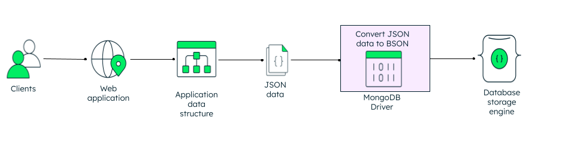

JSON là một định dạng trao đổi dữ liệu được sử dụng rộng rải trong các ứng dụng và những kỹ thuật stacks. Trong khi đó, BSON là cách trình bày dữ liệu JSON dưới dạng nhị phân, nó chủ yếu được sử dụng trong MongoDB, hiểu quả trong việc lưu trữ và duyệt dữ liệu.

---

## JavaScript Object Notation (JSON) là gì?

JSON, là định dạng trao đổi dữ liệu mà con người có thể đọc được, nó được giới thiệu đầu những năm 2000. Thậm chí, JSON còn cơ bản là một subset của ngôn ngữ lập trình JavaScript, nó không phụ thuộc vào ngôn ngữ lập trình.

Đối tượng JSON bao gồm, một `key` map với một `value`. `value` (có thể là number, string, boolean, array, emtpy, null, hoặc một object khác). Trong hầu hết các ngôn ngữ lập trình đều có hỗ trợ kiểu cấu trúc dữ liệu trừ tượng này như: một đối tượng trong JavaScript, dictionaries trong Python, hash table trong Java và C#, array trong C++, v/v..

---

## Dữ liệu JSON thì nhìn nó như thế nào?

Đối tượng JSON là cấu trúc mà con người có thể đọc được, nó cũng dễ dàng cho cả ứng dụng đọc.

```json
{
  "_id": 1,
  "name": { "first" : "John", "last" : "Backus" },
  "contribs": [ "Fortran", "ALGOL", "Backus-Naur Form", "FP" ],
  "awards": [
    {
      "award": "W.W. McDowell Award",
      "year": 1967,
      "by": "IEEE Computer Society"
    }, {
      "award": "Draper Prize",
      "year": 1993,
      "by": "National Academy of Engineering"
    }
  ]
}
```

Đối tượng JSON chứa những cặp key-value được ngăn cách bởi dấu *phẩy*, trong khi đó ngăn cách key và value là dấu *hai chấm*. Đối tượng JSON bắt đầu và kết thúc bởi cặp ngoặc nhọn.

Ngày nay, JSON xuất hiện nhiều trong các trường hợp:

- APIs
- Configuration files
- Log messages
- Database storage

---

## Kết nối MongoDB-JSON

MongoDB được thiết kế cho việc bắt đầu tìm hiểu về cơ sở dữ liệu, nó dành cho những lập trình viên ít kinh nghiệm. JSON là lựa chọn tuyệt vời khi trình bày cấu trúc dữ liệu của [document data model](https://www.mongodb.com/resources/basics/databases/document-databases) trong MongoDB.

Dễ dàng build các ứng dụng với kỹ thuật stacks như **MEAN** và **MERN**, một lập trình viên có thể sử dụng một ngôn ngữ lập trình (JavaScript) cho cả ứng dụng.

Tuy nhiên, có môt số  vấn đề mà JSON ít lý tưởng khi được sử dụng để lưu trữ trong cơ sở dữ liệu như:

1. JSON chỉ hỗ trợ kiểu dữ liệu số cơ bản. Đáng chý ý nhất, JSON ít hỗ trợ kiểu dữ liệu date và dữ liệu nhị phân.

2. Đối tượng JSON và thuộc tính không được fix độ dài làm cho việc duyệt rất chậm.

3. JSON không cung cấp metadata và type information, mất nhiều thời gian hơn khi truy xuất tài liệu.

Để làm MongoDB JSON-first nhưng vẫn có hiệu suất cao và đạt được mục đích chung, BSON được phát minh để: Lưu trữ dữ liệu dạng nhị phân của JSON documenet. Tối ưu về tốc độ, không gian lưu trữ và hiệu quả cao. Nó không giống những định dạng trao đổi nhị phân khác như: Protocal Buffers, hoặc Thrift trong những điều khoản tiếp cận.

---

## Binary JSON document

BSON là viết tắt của **Binary JSON**, một file BSON là cách trình bày dữ liệu dưới dạng nhị phân đúng với một file JSON. Định dạng dữ liệu mã hoá nhị phân của BSON, mã hoá kiểu dữ liệu và thông tin độ dài rất tốt, cho phép nó được truy xuất nhanh hơn rất nhiều khi so sánh với JSON. 

BSON thêm vào các kiểu dữ liệu (không có trong JSON chuẩn) như date và kiểu dữ liệu nhị phân, không có MongoDB sẽ thiếu hỗ trợ những kiểu dữ liệu có giá trị.

---

## File BSON

Ví dụ phía dưới là đối tượng JSON được trình bày đúng với Binary JSON.

```text
{"hello": "world"} →
\x16\x00\x00\x00           // total document size
\x02                       // 0x02 = type String
hello\x00                  // field name
\x06\x00\x00\x00world\x00  // field value
\x00                       // 0x00 = type EOO ('end of object')
 
{"BSON": ["awesome", 5.05, 1986]} →
\x31\x00\x00\x00
 \x04BSON\x00
 \x26\x00\x00\x00
 \x02\x30\x00\x08\x00\x00\x00awesome\x00
 \x01\x31\x00\x33\x33\x33\x33\x33\x33\x14\x40
 \x10\x32\x00\xc2\x07\x00\x00
 \x00
 \x00
```

---

## Cách MongoDB sử dụng BSON và JSON?

MongoDB lưu trữ dữ liệu định dạng BSON cả trong nội bộ và qua network. Bất cứ thứ gì bạn trình bày trong JSON đều có thể lưu trữ trong MongoDB và truy xuất dễ chúng dàng trong JSON. 



Khi sử dụng [MongoDB driver](https://www.mongodb.com/docs/drivers/) với ngôn ngữ lập trình yêu thích của bạn, bạn làm việc với cấu trúc dữ liệu gốc dành cho ngôn ngữ đó. Ứng dụng của bạn cần convert cấu trúc dữ liệu gốc sang JSON. MongoDB driver sẽ lo liệu việc convert dữ liệu từ JSON sang BSON khi lưu trữ vào database, và ngược lại sẽ convert từ BSON sang JSON khi query từ database.

Không giống như hệ thống lưu trữ JSON với dữ liệu là string-endcoded hoặc binary-encoded blobs, MongoDB sử dụng BSON có sức mạnh index và tính năng query dữ liệu có định dạng dành cho hầu hết cộng đồng web.

Ví dụ, MongoDB cho phép các lập trình viên query và thao tác với các đối tượng bởi những keys cụ thể bên trong tài liệu JSON/BSON, kể cả bên trong nested document với nhiều lớp sâu bên trong của bản ghi, và tạo những indexes có hiệu suất cao trên các keys và values giống nhau.

Trước tiên, file BSON có chứa kiểu dữ liệu date hoặc đối tượng nhị phân, nó không có khi trình bày với dữ liệu JSON thuần tuý.

Thứ hai, mỗi ngôn ngữ lập trình có những đối tượng mang ngữ nghĩa riêng. Đối tượng JSON sẽ sắp xếp theo keys, ví dụ, trong khi Python dictionaries thì không thể sắp xếp, trong khi có sự khác nhau giữa kiểu dữ liệu số và kiểu dữ liệu string.

Thứ ba, BSON hỗ trợ nhiều kiểu dữ liệu số mà JSON gốc không có, và nhiều ngôn ngữ lập trình cũng thể hiện sự khác nhau này.

---

## EJSON

EJSON hoặc [Extended JSON](https://www.mongodb.com/docs/manual/reference/mongodb-extended-json/#std-label-mongodb-extended-json-v2) là một JSON-compatible trình bày giá trị BSON trong MongoDB. Một JSON chỉ hỗ trợ một tập hợp con kiểu dữ liệu hỗ trợ bởi BSON, MongoDB thêm phần mở rộng đến định dạng JSON, tên, canonical mode và relaxed mode. MongoDB cung cấp nhiều phương thức giống serialize, deserialize, parse, và stringify dành cho EJSON.

---

## Parse JSON

Khi một ứng dụng writes hoặc updated data vào trong MongoDB sử dụng shell, API hoặc MongoDB Atlas, dữ liệu đã được parsed sang định dạng BSON bởi MongoDB driver. Phân tích cú pháp liên quan đến việc xác định và biên dịch đối tượng JavaScrip hoặc cấu trúc JSON, mapping mỗi trường vào đúng kiểu dữ liệu BSON, và converting values. Khi một ứng dụng request dữ liệu từ MongoDB, driver converts dữ liệu vào trong JSON string trước khi chuyển đến server.

---

## JSON vs BSON

| Thuộc tính             | JSON                                        | BSON                                                                 |
|------------------------|---------------------------------------------|----------------------------------------------------------------------|
| **Mã hoá**             | UTF-8 string                                | Binary                                                               |
| **Hỗ trợ kiểu dữ liệu**| string, boolean, number, array, object, null| string, boolean, number (integer, float, long, decimal128, ...), array, null, date, BinData |
| **Khả năng đọc được**  | Người và máy                                | Chỉ máy                                                              |

JSON và BSON thật sự là những người anh em họ trong thiết kế. BSON được thiết kế để trình bày dữ liệu dưới dạng nhị phân của dữ liệu JSON, với những mở rộng cụ thể dành cho ứng, và tối ưu dành cho việc lưu trữ và duyệt dữ liệu. JSON và BSON đều có hỗ trợ embedding những objects và arrays.

Một cách khác biệt giữa BSON khi so với JSON là nó hỗ trợ nhiều kiểu dữ liệu nâng cao dành cho dữ liệu. JSON không có sự khác nhau giữ số integer, float.

Trong hầu hết server-side đều có nhiều loại kiểu dữ liệu số (integer, float, double, decimal) mỗi một loại đã được tối ưu khi sử dụng hiệu quả cho những hành động tính toán.

---

## References

- [MongoDB](https://www.mongodb.com/resources/basics/json-and-bson)
