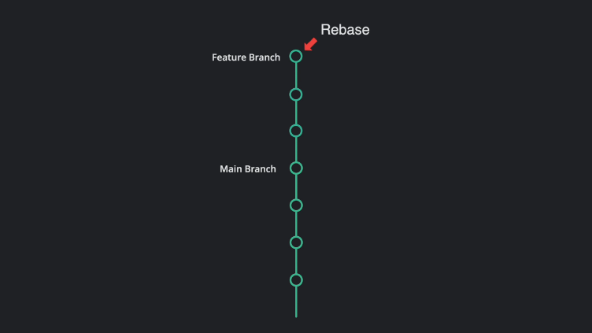

## Tổng quan

Trong bài viết này, chúng ta sẽ học về **git pull rebase**. Trước khi bắt đầu với topic này, chúng ta cần có một cái nhìn tổng quan về **git rebase** và **git pull rebase**

### Git rebase

**Git rebase**: là một hành động trong git, cho phép bạn rewrite commit từ một branch này đến một branch khác. Git rebase cơ bản liên quan đến lấy các commits từ một branch và thêm chúng vào branch khác.

### Git pull rebase

**Git pull rebase**: Chúng ta sử dụng lệnh `git pull --rebase`, để đồng bộ code của chúng ta bằng cách kéo (pull) những commits mới từ remote về máy local của chúng ta.

---

## Git pull rebase là gì?

Khi làm việc trên một dự án trong team, nhiều lần chúng ta cần đồng bộ code bằng cách kéo (pull) từ remote repository về branch trên máy local của chúng ta, chúng ta có thể sử dụng phương thức git pull rebase. Cơ bản, sử dụng phương thức git pull rebase chúng ta sẽ kết hợp những thay đổi đã được published trên remote, với những thay đổi chưa published trên máy local của chúng ta.



Ví dụ, chúng ta có một dự án được clone từ branch main về máy local, và chúng ta có những thay đổi mà chưa published, và branch main có ai đó đã published một commit mới. Khi chúng ta sử dụng phương thức git pull rebase thì git sẽ kết hợp những code update trên branch main và những code thay đổi trên máy local của chúng ta.

### Syntax

```sh
$ git pull --rebase
```

### Khi nào chúng ta sử dụng git pull rebase?

Sử dụng `git pull --rebase` để kết hợp những thay đổi là một cách làm tốt trong một số trường hợp sau:

Khi chúng ta làm việc trên một dự án bất kỳ, chúng ta thường pull code nhiều lần trong ngày để giữ cho code luôn đồng bộ. Hiện tại chúng ta đồng bộ code bằng cách sử dụng lệnh `git pull`, nhưng chúng ta có thể không biết cách mà lệnh `git pull` làm việc, nó sẽ thực hiện đồng thời hai lệnh `git fetch` + `git merge`, và khi đó sẽ có thêm một commit của merge trong log của chúng ta.

Từ bây giờ, chúng ta sử dụng lệnh `git pull --rebase` sẽ tốt hơn rất nhiều, nó giữ cho việc di trì repository rõ ràng hơn, cho đến khi chúng ta push những commit đó lên repository, nó sẽ luôn ở bên trên của môt cây. Khi áp dụng lệnh `git pull --rebase` này thì mỗi commit bạn chưa publish luôn ở bên trên của cây remote, cho phép commits của bạn nằm trên một đường thẳng.

Nếu bạn cần một lựa chọn thưc sự tốt hơn lệnh `merge` các commit, nếu chúng ta muốn merge một branch feature, từ bây giờ chúng ta sẽ có một điểm là kết hợp cả hai nhánh.

Thêm nữa, để giải quyết một phần conflict của commit trong một lần, chúng ta sẽ sử dụng lệnh `git rebase --continue` để đi đến conficts của batch tiếp theo.

**Lưu ý**: `git pull --rebase` được ưu tiên cao khi sử dụng trong trường hợp bạn muốn rebase lịch sử trên máy local, tuy nhiên không nên sử dụng rebase cho bất kỳ nhánh remote (publish hoặc shared), vì nó sẽ thay đổi lịch sử cuả những người khác, đây là cách làm không tốt.  

---

## Cách sử dụng git pull rebase trong CLI như thế nào?

Để thực hiện lệnh `git pull --rebase` trong CLI, chúng ta cần làm theo các bước sau:

1. Điều đầu tiên chúng ta cần làm là di chuyển sang local repository, nơi chúng ta muốn kết hợp thay đổi với remote branch.

2. Sau đó chúng ta cần chạy lệnh `git pull --rebase` trong CLI.

3. Nếu không có conflict trong suốt quá trình thực hiện merge rebase, chúng ta sẽ thấy một thông báo: *Successfully rebased and updated refs/heads/main*. Nếu có bất kỳ conflicts nào, thì những thay đổi chưa được publish của bạn sẽ không được applied. 


Nếu bạn không muốn gõ `--rebase`, bất cứ khi nào pull commits, bạn cần cấu hình git như sau:

```sh
$ git config --global pull.rebase true
```

Nếu bạn muốn chỉnh sửa lịch sử commits trước khi push upstream, bạn có thể sử dụng lệnh sau:

```sh
$ git rebase -i
```
---
 
## Git pull --rebase vs git pull --merge

Bây giờ chúng ta sẽ tìm hiểu sự khác nhau giữa lệnh `git pull --rebase` và `git pull --merge`. Cả rebasing và merging đều là kỹ thuật kết hợp những thay đổi đã publish trên remote với những thay đổi chưa publish trên máy local của chúng ta.

### Rebase:

Còn với git pull rebase, nó hoạt động theo cách khác, những thay đổi chưa publish sẽ được reapplied lên trên top của những thay đổi đã publish và nó không tạo ra một new commit trong lịch sử của bạn.

```sh
$ git pull --rebase
```

### Merge:

Git pull merge là phương thức mặc định để kết hợp những thay đổi trong git, và sẽ merge những thay đổi chưa publish với những thay đổi đã publish, và trả kết quả vào một merge commit trong lịch sử của bạn.

```sh
$ git pull --merge
```

### Best practice:

|Merge|Rebase|
|-|-|
|Sử dụng lệnh git merge khi chúng ta merge branches vào git| Sử dụng lệnh git rebase khi chúng ta tích hợp thay đổi từ một branch đến một branch khác|
|Chúng ta có thể thấy được tất cả lịch sử merging của commits trong log git merge| Commit là một rebase, logs là một đường thẳng trong git rebase|
|Nhánh master sẽ cũng cố tất cả các commit của nhánh feature vào trong một commit|Nhánh master sẽ nhận một số lượng lớn commit trong một lần ở commit rebased|
|Khi targe branch là branch shared hoặc publish thì sử dụng git merge| Khi targe branch là branch private thì sử dụng git rebase|

---

## References

- [gitkraken](https://www.gitkraken.com/learn/git/git-rebase)
- [scaler](https://www.scaler.com/topics/git/git-pull-rebase/)
