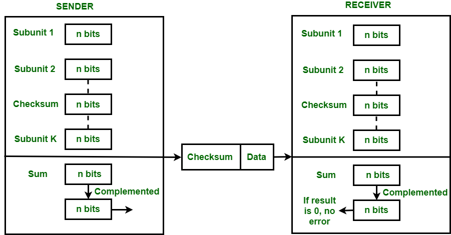

Checksum là giá trị được biểu diễn với những bits trong một message được truyền đi. Các chuyên gia IT thường sử dụng để xác định những lỗi hight-level với dữ liệu khi được truyền đi. Trước khi truyền, một  phần của dữ liệu hoặc file được gán một giá trị là checksum sau khi chạy một hàm `hash` trong `cryptographic` (mật mã học). Thuật ngữ checksum đôi khi được sử dụng để thay thế cho thuật ngữ *hash sum* hoặc *hash value*.
 
## Các lệnh thường dụng để checksum trên OS

| OS        | MD5 Command                          | SHA1 Command                          | SHA256 Command                          |
|-----------|--------------------------------------|---------------------------------------|-----------------------------------------|
| Windows   | `certutil -hashfile file MD5`        | `certutil -hashfile file SHA1`        | `certutil -hashfile file SHA256`        |
| Linux     | `md5sum file`                        | `sha1sum file`                        | `sha256sum file`                        |
| macOS     | `md5 file`                           | `shasum -a 1 file`                    | `shasum -a 256 file`                    |

---

## Tạo sao lại áp dụng checksum?

Mục đích cơ bản nhất của việc tính checksum là dùng để xác định dữ liệu có bị thay đổi không? Việc thay đổi dữ liệu này có thể là kết quả của lỗi hoặc bị tác động. Thông thường, một checksum được tính toán bằng sử dụng một giải thuật để fixed-size (cố định kích thước) một chuỗi hoặc một số để cho phép verify tính toàn vẹn của dữ liệu truyền, và confirm nếu nó không thay thế hoặc bị giả mạo trong suốt quá trình truyền.

Tính toàn vẹn dữ liệu rất hiểu quả để xác định lỗi từ việc cố gắng giả mạo. Lỗi có thể là xảy ra trong suốt quá trình truyền hoặc lưu trữ dữ liệu. Checksum có thể giúp người dùng xác định lỗi. Họ sẽ tính toán checksum của dữ liệu nhận và so sánh nó với checksum từ nhà cung cấp trên dữ liệu gốc. Nếu nó có khác biệt, người dùng biết nó không đúng và có những hành động thích hợp, ví dụ như re-download file hoặc nhờ người gửi gửi lại message.

---

## Cách checksum làm việc?

Checksum hoạt động bằng cách cung cấp cho bên nhận thông tin cuối về việc truyền để đảm bảo toàn bộ dữ liệu đều được nhận. Gía trị của checksum là duy nhất, nó có dạng là một chuỗi các ký tự và số. Nó được tính toán từ data object và được thêm vào trước quá trình chuyển gói tin.

```

@startuml
  actor Sender
  actor Receiver

  Sender -> Sender : Chia dữ liệu thành các khối n-bit
  Sender -> Sender : Cộng tất cả các khối n-bit
  Sender -> Sender : Xử lý overflow (cộng phần tràn nếu có)
  Sender -> Sender : Thực hiện One's Complement (đảo bit)
  Sender -> Receiver : Gửi (Dữ liệu + Checksum)

  Receiver -> Receiver : Nhận dữ liệu và checksum
  Receiver -> Receiver : Cộng tất cả các khối + checksum
  Receiver -> Receiver : Xử lý overflow (cộng phần tràn nếu có)
  Receiver -> Receiver : Kiểm tra tổng
  alt Nếu tổng toàn bit 1
      Receiver -> Receiver : Dữ liệu hợp lệ (OK)
  else Nếu tổng không toàn bit 1
      Receiver -> Receiver : Dữ liệu lỗi (Error)
  end
@enduml

```

Bên gửi, tạo một checksum bằng cách sử dụng giải thuật checksum (MD5, SHA1, SHA256), để tính toán giá trị của checksum từ data object sẽ được chuyển đến cho người nhận. Dữ liệu được chia đều vào trong các subunits (đơn vị nhỏ) với độ dài n-bit (thường là 16 bits) và thêm một phương thức **one's complement** vào subunits có tổng độ dài bằng n bits. Giá trị của **complemented sum** này còn được gọi là checksum được thêm vào cuối của dữ liệu gốc và truyền nó đi. Hành động này được sắp xếp trong một fingerprint của một file hoặc tập hợp của nhiều files để xác định gồm bao nhiêu bits trong quá trình chuyển.



Bên nhận, sau khi nhận đủ dữ liệu và giá trị checksum, sẽ chuyển sang bước **checksum checker**. Checksum checker chia các đơn vị dữ liệu vào trong nhiều subunits bằng với chiều dài n-bit và thêm **complemented sum**. Nếu giá trị dù chỉ có một chút khác biệt (non-zero) so với giá trị checksum từ file gốc, nó cũng sẽ thông báo lỗi trong qúa trình truyền, là  file bị hỏng hoặc bị giả mạo bởi bên thứ ba, trong trường hợp này gọi là malware.

---

## Ví dụ 

Giả sử chungs ta cộng 4 block 16-bit, mỗi block có giá trị rất lớn:

| **Block** | **Dữ liệu (Nhị phân)**     | **Thập phân** |
|-----------|----------------------------|---------------|
| A         | `1111 1111 1111 1111`      | 65535         |
| B         | `1111 1111 1111 1111`      | 65535         |
| C         | `1111 1111 1111 1111`      | 65535         |
| D         | `0000 0000 0000 0100`      | 4             |

Bảng tính toán các giá trị của 4 block

| **Bước**              | **A**                | **B**                | **C**                | **D**                | **Tổng nhị phân**          | **Giải thích**                                      | **Carry**  |
|-----------------------|----------------------|----------------------|----------------------|----------------------|----------------------------|-----------------------------------------------------|------------|
| **Bước 1: A + B**      | `1111 1111 1111 1111` (65535) | `1111 1111 1111 1111` (65535) | -                    | -                    | `1_1111 1111 1111 1110`    | Cộng A và B, có **overflow 1 bit**.                | 1 (carry)  |
| **Bước 2: (A + B) + C**| `1111 1111 1111 1110` (65534) | -                    | `1111 1111 1111 1111` (65535) | -                    | `1_1111 1111 1111 1101`    | Cộng (A + B) với C, có **overflow 1 bit**.        | 1 (carry)  |
| **Bước 3: ((A + B) + C) + D** | `1111 1111 1111 1101` (65533) | -                    | -                    | `0000 0000 0000 0100` (4) | `1_0000 0000 0000 0000`    | Cộng ((A + B) + C) với D, có **overflow 1 bit**.  | 1 (carry)  |
| **Bước 4: Cộng carry** | -                    | -                    | -                    | -                    | `0000 0000 0000 0101`      | Cộng tổng carry vào kết quả, kết quả là `5`.      | -          |
| **Bước 5: Đảo bit**    | -                    | -                    | -                    | -                    | `1111 1111 1111 1010`      | Đảo bit để tính checksum.                         | -          |

### **Tóm tắt:**
- **A, B, C, D** lần lượt có giá trị nhị phân như sau:
  - A = `1111 1111 1111 1111` (65535)
  - B = `1111 1111 1111 1111` (65535)
  - C = `1111 1111 1111 1111` (65535)
  - D = `0000 0000 0000 0100` (4)
- Kết quả checksum cuối cùng sau khi cộng tất cả và đảo bit là **`1111 1111 1111 1010`** (decimal = -5).

---
## Các nhân tố gây mất tính toàn vẹn của số checksum

Không phải bất cứ lúc nào giá trị của checksum cũng matches, dữ liệu trong quá trình chuyển có thể bị xáo trộn. Nhiều nhân tố có thể gây nên sự xáo trộn dữ liệu như sau:

- Gián đoạn kết nối mạng làm cho số checksum không còn nhất quán.
- Sự cố về không gian lưu trữ hoặc thiết bị phần cúng gây nên vấn đề trong checksum.
- Disk hỏng hoặc File hỏng có thể gây lỗi trong checksum.
- Có sự tác động của bên thứ ba trong quá trình chuyển dữ liệu.

---

## Ưu điểm của checksum

Giải thuật cơ bản của checksum là giải thuật mã hoá đối xứng để xác nhận tính toàn vẹn của dữ liệu và xác thực trong một số ứng dụng, và nó có thể xác định nếu có bất kỳ giả mạo hoặc lỗi tình cơ xuất hiện trong quá truyền dữ liệu sử dụng mạng public/private, clouds hoặc hard drivers. Checksum cung cấp một cảnh báo để chặn việc mất mát dữ liệu không mong muốn hoặc chặc các sự kiện viruses không mong muốn, malware. Chúng cung cấp cách để người dùng xác định dữ liệu truyền không hoàn tất, ví dụ như file bị chỉnh sửa hoặc bị xoá.

Checksum còn được sử dụng trong lưu trữ. Ví dụ dữ liệu lưu trong shared drivers và cho nhiều người truy cập thông qua internet có thể bị chỉnh sửa hoặc giả mạo. Nó có thể bị duplicated, với một file khác có chứa cùng dữ liệu lưu trữ nhưng khác locations. Áp dụng checksum có thể giúp xác định các sự kiện và làm tăng tính trách nhiệm cho hệ thống, ví dụ như, nếu dữ liệu được lưu trữ trong thời gian dài, checksum rất tiện lời và đảm bảo luôn bảo mật và xác thực.

Cuối cùng, checksum còn giúp tạo ra một kho dữ liệu với mục đích lưu trữ. Lưu trữ dữ liệu có thể không còn được sử dụng hoặc lưu trữ trong các thiết bị lưu trữ lỗi thời (CDs, casettes, etc ...). Bởi vì việc tính toán một chuỗi các ký tự duy nhất từ dữ liệu file, thì file có thể xác nhận tính toàn vẹn, đảm bảo dữ liệu không bị hỏng trong suốt qúa trình truyền.

---

## Nhược điểm của checksum

Checksum được sử dụng để xác định lỗi trong quá trình truyền dữ liệu hoặc thao tác với dữ liệu, do đó chúng không thể xác định được loại lỗi. Nó chỉ giới hạn trong việc xác định lỗi giống như sắp xếp lại bytes (sắp xếp bytes sai vị trí), thiếu bytes, mất dữ liệu từ kết quả của việc toàn vẹn dữ liệu và không đúng trong giao tiếp nếu chúng ta có sử dụng checksum.

Thêm nữa, checksum cũng là phương thức không hoàn toàn đáng tin cậy trong việc bảo vệ dữ liệu trên đường truyền. Giá trị có thể bị tác động hoặc giả mạo bởi bên thứ ba. Họ sẽ sử dụng những phương thức tinh vi để chỉnh sửa và rending checksum để đảm báo tính toàn vẹn của dữ liệu.

Một hạn chế khác, là checksum chỉ có thẻ xác định lỗi. Nó không được xây dựng cho việc fix lỗi và recover dữ liệu hỏng. Cuối cùng, việc tính toán checksum và thêm nó vào phía trên đầu của dữ liệu truyền được xử lý rất phức tạp. 

---

## Ứng dụng checksum và các trường hợp sử dụng

Việc xác nhận tính toàn vẹn của dữ liệu rất quan trọng trong nhiều ứng dụng. Bởi vì đó cũng là mục đính chính của checksum, do đó checksum được sử dụng trong trường hợp sử dụng như sau:

- Network communications (Giao tiếp mạng)
- Cybersecurity (An ninh mạng) - Đảm bảo tính bảo mật dữ liệu, tính toàn vẹn dữ liệu, và tính khả dụng của dữ liệu.
- Lưu trữ dữ liệu.
- Xác nhận log files.
- Phần mền phân tán và update phần mền.
- Know Your Customer (KYC) và xác nhận (trong các dịch vụ  ngân hàng)
- Kiểm tra tính khản dụng của sản phẩm trên E-commerce.
- Xác nhận thanh toán bill.
- Xác nhận và giao tiếp trong các trường hợp kiểm tra sức khoẻ.

---

## Tham khảo

- [techtarget](https://www.techtarget.com/searchsecurity/definition/checksum)
- [geeksforgeeks](https://www.geeksforgeeks.org/error-detection-code-checksum)
