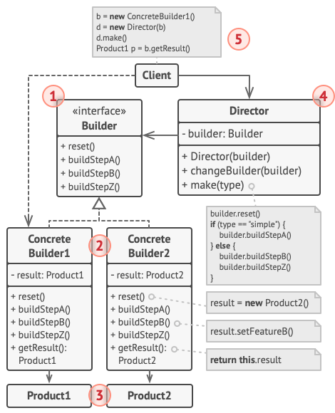

## Intent

**Builder** là một creational design pattern cho phép bạn tạo một đối tượng phức tạp với step by step. Pattern này cho phép bạn tạo các kiểu sản phẩm khác nhau với cùng một construction code.

---

## Problem

Hãy tưởng tượng một đối tượng phức tạp, được yêu cầu khởi tạo step by step cho nhiều trường và nested objects. Code khởi tạo thường phải chôn vùi những thứ khó hiểu bên trong constructor với rất nhiều parameters. Hoặc trường hợp tệ hơn tất cả các đối tượng này sẽ gây rác cho client code.

Ví dụ , bạn hãy nghĩ về cách tạo một đối tượng `House`. Để xây một ngôi nhà đơn giản, bạn cần xây dựng bốn bức tường và sàn nhà, lắp đặt cửa ra vào, đặt một cặp cửa sổ, và xây thêm mái nhà. Nhưng nếu bạn muốn một cần ngôi nhà lớn hơn, sáng sửa hơn, với sân vườn và những thứ khác (như hệ thống sưởi, hệ thống điện, ..) 

Giải pháp đơn giản là mở rộng base class `House` và tạo một tập hợp subclasses để cover tất cả các tổ hợp nhà bên trên với parameters. Nhưng cuối cùng bạn sẽ có số lượng đáng kể các subclasses. Nếu có một parameter mới, giống như mái hiên, sẽ yêu cần bạn thậm chí phát triển nhiều kế thừa hơn.

Một cách tiếp cận khác, không liên quan đến subclasses. Bạn có thể tạo một constructor khổng lồ trong class base `House` đảm bảo tất cả parameters sẽ điều khiển việc tạo đối tượng house. Với hướng tiếp cận này nó đã loại bỏ hết tất cả subclasses nhưng nó sẽ tạo ra vấn đề khác.

Hầu hết các parameters sẽ không được sử dụng, làm cho việc gọi constructor rất xấu xí. Ví dụ, chỉ một một phần nhỏ các ngôi nhà là có hồ bơi, thì parameter có liên quan đến hồ bởi sẽ không được sử dụng trong 9 trên 10 lần tạo.

---

## Solution

Builder pattern khuyên bạn cần mở rộng constructor code của đối tượng ra bên ngoài class đó, và chia nhỏ nó thành nhiều đối tượng được gọi là **builders**

Mẫu constructor của đối tượng gốc được chia vào trong tập hợp các bước (`buildWalls`, `builderDoor`, etc). Tạo một object, bạn sẽ thực thi một chuỗi những bước để xây dựng đối tượng. Phần quan trọng là bạn không cần gọi tất cả các bước. Bạn có thể chỉ cần một số bước cần thiết trong quá trình tạo sản phẩm được cấu hình dành cho đối tượng.

Một số bước xây dựng có những yêu cầu khác nhau khi triển khai, như bạn cần xây dựng những biến thể cho sản phẩm. Ví dụ, tường của một cabin có thể được xây bằng gỗ, nhưng tường của một lâu đài bắt buộc phải xây dựng bằng đá.

Trong trường hợp này , bạn có thể tạo nhiều class builders khác nhau để triển khai việc tạo sản phẩm. Bạn có thể sử dụng trong construction process để tạo ra những loại đối tượng khác nhau.

Ví dụ, hãy tưởng tượng một builder xây dựng mọi thứ từ gỗ và kính, một cái thứ hai là từ đá và sắt, và cái thứ ba là từ vàng và kim cương. Các bước gọi tập hợp đều giống nhau, giống như xây một ngôi nhà bình thường, một lâu đài nhỏ hoặc một dinh thự. Tuy nhiên, nó chỉ có thể làm việc nếu client code gọi các bước cho các builders đều sử dụng cùng common interface.

---

## Director

Bạn có thể mở rộng chuỗi gọi các bước builder sử dụng constructor để tạo sản phẩm, chia nó vào trong class gọi là *director*. Class Director định nghĩa thứ tự thực hiện các bước building.

Class director trong chương trình của bạn là không cần thiết. Bạn có thể gọi trực tiếp các bước building theo thứ tự từ client code. Tuy nhiên, class director có thể là một nơi tốt để bạn đẩy nhiều biến thể constructor thường xuyên được sử dụng cho chương trình.

Thêm nữa, class director ẩn những chi tiết phức tạp của constructor với client code. Client code chỉ cần kết hợp một builder với một director, chạy construction với director, và lấy kết quả từ builder.

---

## Structure

1. Interface **Builder** khai báo construction chứa các bước chung của tất cả kiểu builder.

2. **Concrete Builders** cung cấp các triển khai khác nhau của các bước construction. Concrete builders có thể sản xuất sản phẩm mà không cần follow common interface.

3. **Products** là kết quả của những objects. Khởi tạo một sản phẩm bởi các builders khác nhau không phụ thuộc vào những class kế thừa hoặc interface giống nhau.

4. Class **Director** định nghĩa thứ tự các bước khởi tạo, bạn có thể tạo và tái xử dụng chính xác cấu hình của sản phẩm.

5. **Client** bắt buộc kết hợp một builder object với director. Thông thường, nó chỉ thực hiện một lần, thông qua parameters của director constructor. Sau đó director sử dụng đối tượng builder cho tất cả các lần khởi tạo sau. Tuy nhiên, có một hướng tiếp cận khác, khi client code passes đối tượng builder vào phương thức sản xuất của director. Trong trường hợp này, bạn có thể sử dụng một builder khác cho mỗi lần bạn sản xuất một thứ gì đó từ director.

---

## Applicability

### Sử dụng pattern Builder để tránh một "telescoping constructor".

Bạn có một constructor với 10 option parameters. Việc gọi nó rất bất tiện, vì vậy, bạn phải tải hết constructor với các phiên bản ít parameters hơn. Những constructor này sẽ tham chiếu đến một constructor chính, passing một số giá trị mặc định vào trong bất kỳ parameter này được bỏ qua.

Builder pattern sẽ xây dựng đối tượng step by step, chỉ sử dụng những bước bạn thực sự cần. Sau khi triển khai pattern, bạn sẽ không cần truyền hàng tá parameters vào trong bất kỳ constructor nào.

### Sử dụng pattern Builder khi bạn muốn code có thể tạo những đại diện khác nhau của product (ví dụ như xây nhà đá và nhà gỗ)

Pattern Builder có thể áp dụng khi constructor đại diện cho nhiều product giống các bước xây dựng nhưng chỉ khác nhau trong những chi tiết.

Định nghĩa base builder interface cho tất cả các bước xây dựng, và concrete builders sẽ triển khai các bước xây dựng cho từng đại diện của từng sản phẩm. Trong khi đó, class director sẽ hướng dẫn thứ tự xây dựng.

### Sử dụng pattern Builder để xây dựng Composite trees hoặc những đối tượng phức tạp khác.

Pattern Builder giúp bạn xây dựng product theo từng bước. Bạn có thể trì hoản thực hiện một số bước mà không phá vở product cuối cùng. Bạn có thể gọi đệ quy, trong trường hợp bạn cần xây dựng một object tree.

Một builder không phởi ra product chưa hoàn thiện khi chạy các bước xây dựng. Tránh việc client code gọi đến một kết quả chưa hoàn thành.

---

## How to Implement

---

## Reference

