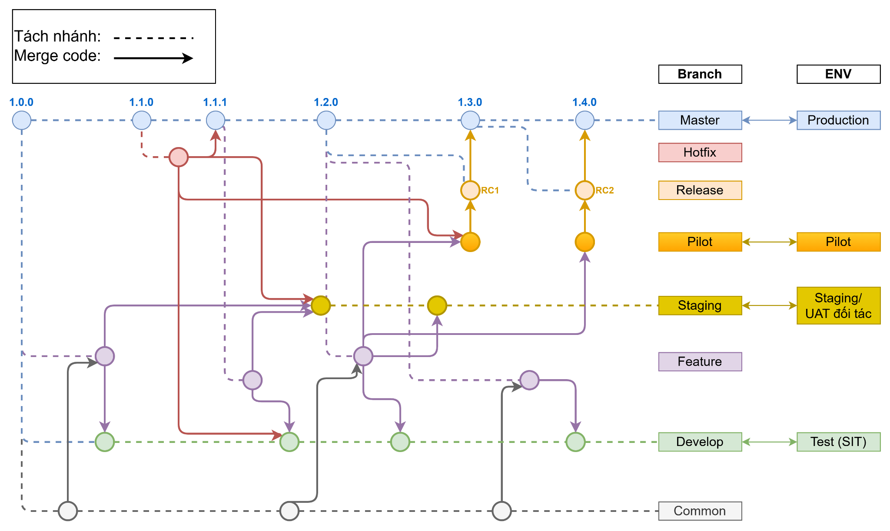

# Quy định về kiểm soát mã nguồn trong dự

## Hình ảnh git flow

---

## Bảng ý nghĩa và cách đặt tên nhánh

| Nhánh         | Ý nghĩa                                                                                                                                   |
| ------------- | ----------------------------------------------------------------------------------------------------------------------------------------- |
| `master/main` | Nhánh chính, phản ánh phiên bản hiện tại trên môi trường **PROD**.                                                                        |
| `hotfix`      | Nhánh dùng để sửa chữa các lỗi trên môi trường **PROD**.                                                                                  |
| `release`     | Nhánh chuẩn bị phát hành các tính năng đã sẵn sàng triển khai lên **PROD**. Bắt buộc phải đánh `tag` phiên bản và cập nhật **changelog**. |
| `pilot`       | Nhánh chứa các tính năng chuẩn bị **golive**, được triển khai thử nghiệm cho một phạm vi nhỏ người dùng thật.                             |
| `staging`     | Nhánh phục vụ môi trường tích hợp với đối tác, kiểm thử từ phía đối tác.                                                                  |
| `develop`     | Nhánh phục vụ cho môi trường **test (SIT)**.                                                                                              |
| `feature`     | Nhánh phát triển tính năng mới.                                                                                                           |
| `common`      | Nhánh chứa các hàm dùng chung, thường được sử dụng trong 2 hoặc nhiều `feature` đang phát triển song song.                                |

---

## Tách nhánh

Tôi thường thấy các dự án có 2 kiểu tách nhánh một là từ `master`, hai là từ `develop` sẽ tuỳ thuộc vào đặc tính của từng dự án, mỗi lựa chon có những ưu nhược điểm riêng.

### So sánh ưu và nhược điểm khi tách nhánh từ `master` và `develop`

| Tiêu chí                   | Tách từ `master`                                                                                                                    | Tách từ `develop`                                                                                                                                                   |
| -------------------------- | ----------------------------------------------------------------------------------------------------------------------------------- | ------------------------------------------------------------------------------------------------------------------------------------------------------------------- |
| **Độ ổn định**             | Cao: `master` phản ánh phiên bản đã triển khai trên môi trường **PROD**, đảm bảo mã nguồn ổn định.                                  | Thấp: `develop` chứa các thay đổi mới nhất, có thể chưa được kiểm thử đầy đủ.                                                                                       |
| **Rủi ro xung đột**        | Thấp: Ít thay đổi trên `master`, nên khả năng xung đột thấp.                                                                        | Cao: Nhiều thay đổi trên `develop`, dễ xảy ra xung đột khi merge.                                                                                                   |
| **Tích hợp với tính năng** | Khó: Không đồng bộ với các tính năng đang phát triển, dễ xảy ra xung đột khi merge.                                                 | Dễ: Đồng bộ với các tính năng mới nhất, phù hợp với môi trường phát triển.                                                                                          |
| **Phù hợp với mục đích**   | Phù hợp khi cần sửa lỗi khẩn cấp hoặc phát triển tính năng độc lập, không phụ thuộc vào thay đổi khác.                              | Phù hợp khi phát triển tính năng cần tích hợp với các thay đổi mới hoặc kiểm thử trong môi trường SIT.                                                              |
| Kiểu dự án                 | Các dự án phát triển theo mô hình alige, dự án làm với đối tác, hoặc dự án cần có tính linh hoạt trong quá trình phát hành sản phẩm | Dự án phát triển theo mô hình waterfall, dự án nội bộ trong đó các task được phát triển và phát hành tuần tự theo dạng cuốn chiếu, task sau gói đầu lên task trước. |

### Quy tắc khi tách và đặt tên nhánh.

Khi tách một nhánh chúng ta bắt buộc cần phải tuân thủ quy tắc như sau:

- `<branch-name>` `/` `<task-id>`

  - `<branch-name`: theo bảng bên trên.
  - `<task-id>`: là id của một task trên phầm mền quản lý dự án. VD: `feature/ECMBASE-123`, `hotfix/ECMBASE-456`.

**Lưu ý:** Khi cần golive một gói bất kỳ, bắt buộc phải tách nhánh `release` và merge các tính năng cần chuẩn bị golive vào. Không được phép merge trực tiếp vào `master`.

---

## Merge nhánh

Chỉ merge nhánh theo yêu cầu, có sự đồng ý của PM, hoặc PO quản lý hệ thống. Nhánh được merge phải được người khác reivew (thường là techlead).

### Merge request hoặc pull request

Merge request là một quy trình kiểm soát mã nguồn trước khi merge, với mục đích:

- **Code review**: Đảm bảo code phải được kiểm tra bởi ít nhất một trong số các thành viên khác trong dự án.
- **Xác định trước conflict**: Kiểm tra trước mã nguồn sau khi merge có conflict không?
- **Báo cáo**: Chỉ có TechLead, PM, PO mới có quyền approve merge request, việc này giúp họ nắm bắt được tiến độ, tính năng đã được phát hành của hệ thống.

Quy trình phải đi qua nhiều bước trước khi merge một nhánh nên điều đó cũng là một hạn chế. Tính năng này không phù hợp trong môi trường phát triển dự án.

Merge request chỉ thích hợp khi cần merge một nhánh vào `master` để đảm bảo mã nguồn luôn ổn định. Thường chỉ có nhánh `release`, và `hotfix` mới tạo merge request vì chỉ có hai nhánh này mới được phép merge vào `master`.

---

## Commit

Khi commit, bạn nên tuân thủ quy tắc đặt tên bên dưới cho thông điệp, việc này giúp chúng ta dễ dàng trace commit trong tương lại, khi dự án có hàng nghìn, đến hàng triệu commit:

- `git commit` `<branch-name>` `[:, -]` `<message> `

**Lưu ý:** Nên sử dụng `commit-msg` của git hook để kiểm tra nội dung thông điệp bên trên.

---

## Tag

Khi phát hành (releaes) một phiên bản, bạn cần phải gắng `tag` cho chúng. Việc này giúp chúng ta dễ đàng rollback trong trường hợp golive thất bại mà đã merge nhánh release và master.

- **Tạo tag**: Chạy lênh `tag -a <version> -m <message>` để tạo tag ở local repository. VD: tag -a v1.1.0 -m "#release/v1.1.0: Golive tính năng ABC".

  - `<version>` chuẩn có dạng `<v>
.<r>.<h>` với:
    - `<v>`: Đại diện cho từ version (phiên bản)
    - `
`: Phiên bản của dự án. Thông thường sẽ là những lần nâng cấp lớn như thay đổi kiến trúc, framework, ...
    - `<r>`: Số lần release
    - `<h>`: Số lần hotfix của release golive trước đó

- **Push tag** `push <remote> <tag-version>`. VD: push origin v1.1.0
