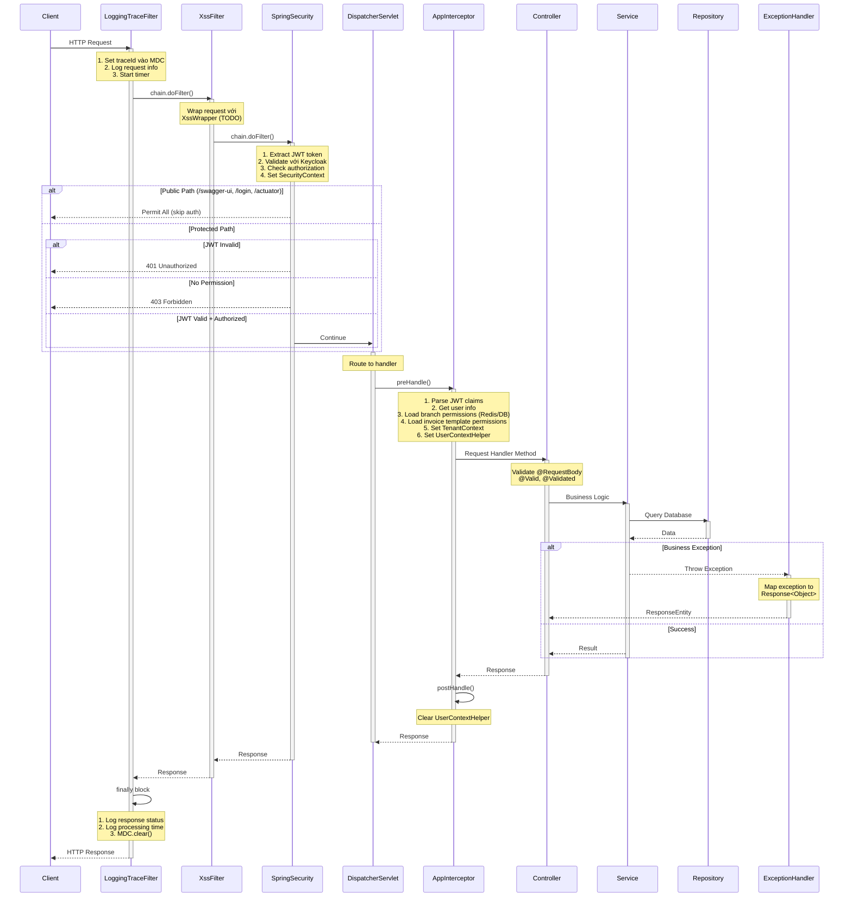

# Pipline xử lý request trong Spring

Khi một request đến ứng dụng Spring, nó sẽ trải qua một chuỗi các bước xử lý trước khi nhận được phản hồi.
Dưới đây là mô tả về các bước trong pipeline xử lý request của Spring:

## Filters (Servlet Filter)

- Chặn sớm nhất trong tầng servlet. Thao tác trên `ServletReqeust/Response` trước khi vào Spring.
- Thường được sử dụng cho logging, tracing, XSS Wrapper, chỉnh Headers, CORS.

---

## Security Filter (Spring Security)

- Một `DelegatingFilterProxy` đứng trong filterChain, bên trong chứa nhiều security filter như:
    - Authentication
    - Authorization
    - Exception Translation
- Sử dụng để bảo vệ tài nguyên, xác thực người dùng, phân quyền truy cập, tránh tốn kém tài nguyên phía sau.

---

## DispatcherServlet

- Đúng trước Controller của Spring MVC. Định tuyến request tới handler(controller) phù hợp.
- Quản lý binding, conversion, message converters

---

## Handler Interceptors (Spring MVC)

- Hook ở mức MVC: trước và sau khi controller xử lý request.
- preHandle: Trước khi controller xử lý request.
- postHandle: Sau khi controller xử lý nhưng trước khi view được render.
- afterCompletion: Sau khi view được render.
- Thường dùng để logging, đo thời gian thực thi, thêm dữ liệu chung vào model.

---

## Controllers (Spring MVC)

- Xử lý logic nghiệp vụ chính cho request.

---

## ExceptionAdvice (Spring MVC)

- Xử lý ngoại lệ phát sinh trong quá trình xử lý request, tránh lộ stacktrace ra client.
- Cung cấp phản hồi lỗi chuẩn hóa, thân thiện với người dùng.

---

## Sequence Diagram

