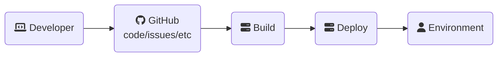

## Cấu hình

---

## Sử dụng

### Sử dụng Mermaid trong Markdown

Cần phải plugin thêm [jekyll-mermaid](https://github.com/jasonbellamy/jekyll-mermaid) để tạo được diagram tại máy local. Như ví dụ bên dưới



Tuy nhiên, plugin này không phải là official của `GitHubPages` nên không được hỗ trợ. Do đó chúng ta sẽ sử dụng trực tiếp `html tag` trong file markdown để giải quyết vấn đề này.

### Sử dụng Mermaid trực tiếp với `html tag`

Thêm file `mermaid.html` trong thư mục `_includes`. Nếu không tìm thấy thư mục `_includes` thì tạo mới.

```html
<script type="module">
    import mermaid from 'https://cdn.jsdelivr.net/npm/mermaid@10/dist/mermaid.esm.min.mjs';
    let config = { 
        startOnLoad: true,
        theme: "dark", 
        flowchart: { 
            useMaxWidth: true, 
            htmlLabels: true 
        } 
    };
    mermaid.initialize(config);
</script>
```

Sau đó update file `head.html` hoặc thêm mới nếu chưa có trong thư mục `_include`

```html

    


```

Tạo diagram như bên dưới

```html
<div class="mermaid">
flowchart LR
    A(fa:fa-laptop-code Developer) --> B(fab:fa-github GitHub<br>code/issues/etc)
    B --> C(fa:fa-server Build)
    C --> D(fa:fa-server Deploy)
    D --> E(fa:fa-user Environment)
</div>
```
---

## Resource

[Diagram with Mermaid](https://jojozhuang.github.io/tutorial/jekyll-diagram-with-mermaid/)

[Adding Mermaid Diagrams](https://some-natalie.dev/blog/mermaid-diagrams/)

[Mermaid cheat sheet](https://jojozhuang.github.io/tutorial/mermaid-cheat-sheet/)

[Mermaid theme](https://mermaid.js.org/config/theming.html)