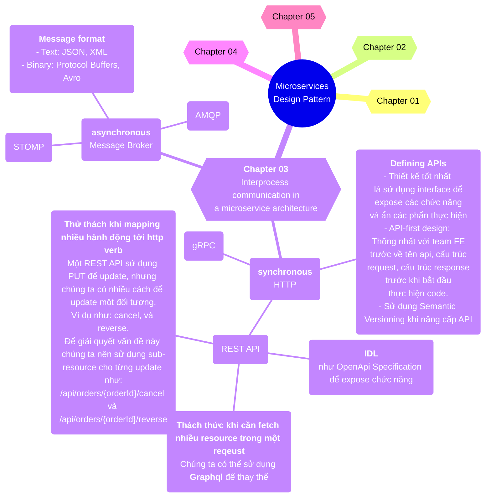

```mermaid
mindmap
  root((Microservices<br/>Design Pattern))
    
    {{Chapter 01}}
      
    {{Chapter 02}}

    {{**Chapter 03**
      Interprocess communication in
      a microservice architecture
    }}
      (**synchronous**
        HTTP
      )
        (**Defining APIs**
            - Thiết kế tốt nhất 
              là sử dụng interface để
              expose các chức năng
              và ẩn các phẩn thực hiện
            - API-first design: 
              Thống nhất với team FE
              trước về tên api, cấu trúc
              request, cấu trúc response
              trước khi bắt đầu
              thực hiện code.
            - Sử dụng Semantic Versioning khi nâng cấp API
          )
        (REST API)
          (**IDL**
           như OpenApi Specification để expose chức năng
          )
          (**Thách thức khi cần fetch 
            nhiều resource trong một reqeust**
            Chúng ta có thể sử dụng 
            **Graphql** để thay thế
          )
          (**Thử thách khi mapping nhiều hành động tới http verb**
            Một REST API sử dụng PUT để update, nhưng chúng ta có nhiều cách để update một đối tượng.
            Ví dụ như: cancel, và reverse.
            Để giải quyết vấn đề này chúng ta nên sử dụng sub-resource cho từng update như:
            /api/orders/#123;orderId#125;/cancel và /api/orders/#123;orderId#125;/reverse
          )
        (gRPC)
        
      (**asynchronous**
        Message Broker
      )
        (**Message format**
          - Text: JSON, XML
          - Binary: Protocol Buffers, Avro
        )
        (AMQP)
        (STOMP)


    {{Chapter 04}}

    {{Chapter 05}}

```                                 