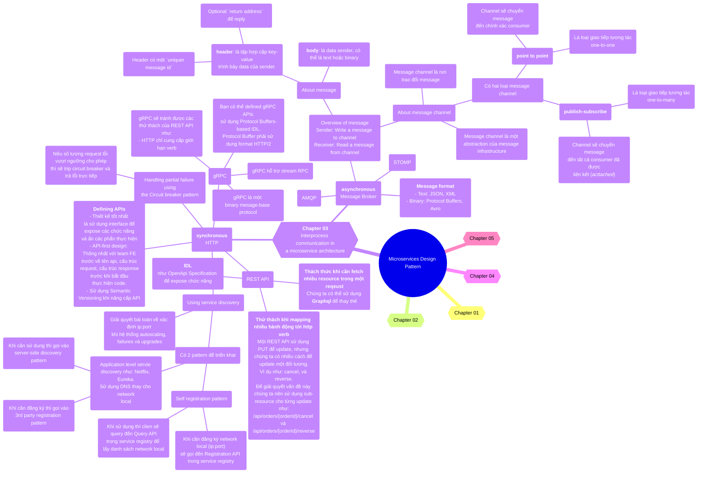

```mermaid
mindmap
  root((Microservices Design Pattern))
    
    {{Chapter 01}}
      
    {{Chapter 02}}

    {{**Chapter 03**
      Interprocess communication in
      a microservice architecture
    }}
      (**synchronous**
        HTTP
      )
        (**Defining APIs**
            - Thiết kế tốt nhất 
              là sử dụng interface để
              expose các chức năng
              và ẩn các phẩn thực hiện
            - API-first design: 
              Thống nhất với team FE
              trước về tên api, cấu trúc
              request, cấu trúc response
              trước khi bắt đầu
              thực hiện code.
            - Sử dụng Semantic Versioning khi nâng cấp API
          )
        (REST API)
          (**IDL**
           như OpenApi Specification để expose chức năng
          )
          (**Thách thức khi cần fetch 
            nhiều resource trong một reqeust**
            Chúng ta có thể sử dụng 
            **Graphql** để thay thế
          )
          (**Thử thách khi mapping nhiều hành động tới http verb**
            Một REST API sử dụng PUT để update, nhưng chúng ta có nhiều cách để update một đối tượng.
            Ví dụ như: cancel, và reverse.
            Để giải quyết vấn đề này chúng ta nên sử dụng sub-resource cho từng update như:
            /api/orders/#123;orderId#125;/cancel và /api/orders/#123;orderId#125;/reverse
          )
        (gRPC)
          (gRPC sẽ tránh được các thử thách của REST API như:
            - HTTP chỉ cung cấp giới hạn verb
          )
          (gRPC là một 
            binary mesage-base protocol
          )
          (gRPC hỗ trợ stream RPC)
          (Bạn có thể defined gRPC APIs 
            sử dụng Protocol Buffers-based IDL.
            Protocol Buffer phải sử dụng format HTTP/2
          )
        (Handling partial failure using
          the Circuit breaker pattern
        )
          (Nếu số lượng request lỗi vượt ngưỡng cho phép
           thì sẽ trip circuit breaker và trả lỗi trực tiếp
          )
        (Using service discovery)
          (Giải quyết bài toàn về xác định ip:port 
            khi hệ thống autoscaling, failures và upgrades
          )
          (Có 2 pattern để triển khai)
            (Self registration pattern)
              (Khi cần đăng ký network local #40;ip:port#41;
               sẽ gọi đến Registration API trong service registry
              )
              (Khi sử dụng thì clien sẽ query đến Query API
                trong service registry để lấy danh sách network local
              )
            (Application level servie discovery như: Netflix, Eureka.
              Sử dụng DNS thay cho network
              local
            )
              (Khi cần đăng ký thì gọi vào
               3rd party registration pattern
              )
              (Khi cần sử dụng thì gọi vào
               server-side discovery pattern
              )
        
      (**asynchronous**
        Message Broker
      )
        (**Message format**
          - Text: JSON, XML
          - Binary: Protocol Buffers, Avro
        )
        (AMQP)
        (STOMP)
        (Overview of message
          Sender: Write a message to channel
          Receiver: Read a message from channel
        )
          (About message)
            (**header**: là tập hợp cặp key-value
              trình bày data của sender.
            )
              (Header có một `uniquer message id`)
              (Optional `return address` để reply)
            (**body**: là data sender, có thể là text hoặc binary)
          (About message channel)
            (Message channel là nơi trao đổi message)
            (Message channel là một abstraction của message infrastructure)
            (Có hai loại message channel)
              (**point to point**)
                (Channel sẽ chuyển message
                  đến chính xác consumer
                )
                (Là loại giao tiếp tương tác
                  one-to-one
                )
              (**publish-subscribe**)
                (Channel sẽ chuyển message
                  đến tất cả consumer đã được
                  liên kết #40;*acttached*#41;
                )
                (Là loại giao tiếp tương tác
                 one-to-many
                )

    {{Chapter 04}}

    {{Chapter 05}}
```